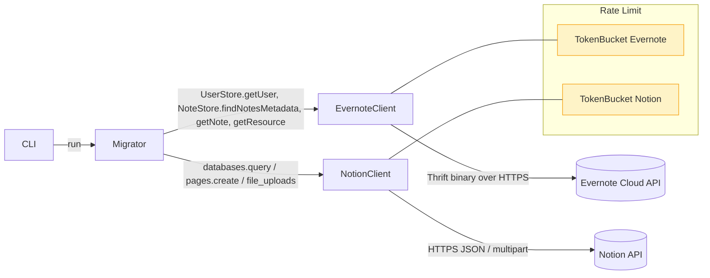

# evernote-to-notion

Evernote のすべてのノート (PDF / 動画含む) を Notion ページとして移行する Rust 製 CLI。

- SDK は使用せず、Apache Thrift Binary Protocol を最小限自前実装して Evernote の `UserStore` / `NoteStore` を直接呼び出す。
- 添付ファイルは Notion `file_upload` API で Notion ストレージにアップロードする。
- 各 Notion ページには Evernote の内部リンク (`evernote:///view/<userId>/s<shard>/<guid>/<guid>`) を `Evernote URL` プロパティとして保存し、再実行時に冪等になる。
- Evernote 側の `EDAMSystemException.rateLimitDuration` を尊重し、Notion 3 RPS / Evernote 2 RPS のトークンバケットで並列度を制御する。

## アーキテクチャ



## 使い方

事前準備:

1. Evernote で Developer Token を取得し `EVERNOTE_DEV_TOKEN` に設定。
2. 自分の `notestore` URL を `EVERNOTE_NOTESTORE_URL` に設定 (例: `https://www.evernote.com/shard/s396/notestore`)。`UserStore.getNoteStoreUrl` 相当は今回は省略しているので手動指定。
3. Notion インテグレーションを作成し `NOTION_TOKEN` を発行。
4. 移行先データベースに `Name (title)` と `Evernote URL (url)` プロパティを用意し、データベース ID を `NOTION_DATABASE_ID` に設定。

```bash
mise install
mise run check         # fmt:check + clippy + test
mise run run -- dry-run --limit 3
mise run run -- migrate --batch-size 50
```

## mise タスク

| task | 内容 |
| --- | --- |
| `build` | `cargo build --all-targets` |
| `test` | `cargo test --all-targets --all-features` |
| `lint` | `cargo clippy --all-targets --all-features -- -D warnings` |
| `fmt` | `cargo fmt --all` |
| `fmt:check` | `cargo fmt --all -- --check` |
| `check` | 上 3 種をまとめて実行 (CI と同じ) |
| `run` | リリースビルドでバイナリ起動 |

## TDD

t-wada 流の red → green → refactor サイクルで実装 (commit 単位で履歴に残る)。各モジュールにユニットテストを併設し、HTTP 通信は `wiremock` でモック化。
