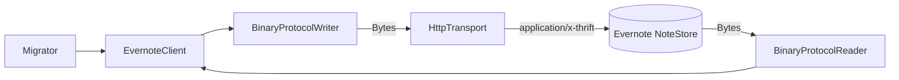

# ADR-01: Evernote → Notion 移行ツールのアーキテクチャ

- ステータス: Accepted
- 日付: 2026-05-02 (Asia/Tokyo)
- コンテキスト
  - 自分の Evernote アカウント (PDF / 動画含む) を全件 Notion ページとして移行したい。
  - 各 Notion ページに Evernote の内部リンク (`evernote:///view/<userId>/s<shard>/<guid>/<guid>`) を保存し、再実行時に冪等にしたい。
  - SDK は信頼性が懸念のため使わず、API を直接叩く方針。
  - レート制限を尊重し、長時間バッチ実行に耐える。

## 決定

### 1. Evernote API は Apache Thrift Binary Protocol を Rust で最小自前実装

- Evernote の `UserStore` / `NoteStore` は Thrift over HTTPS でしか提供されていない (REST は添付ダウンロード補助のみ)。
- `crates.io` 上の thrift 系 crate は更新が止まっているうえスケジューラ機能が薄く、依存範囲を広げたくない。
- 必要な操作は数個 (`getUser`, `findNotesMetadata`, `getNote`, `getResource`) で、それぞれの引数 / 結果 struct も狭い。Binary Protocol の Writer / Reader を `bytes::{Buf, BufMut}` で書く。
- 既知の Exception (`EDAMUserException` / `EDAMSystemException` / `EDAMNotFoundException`) は result struct のフィールド ID 1..=3 で来る Thrift 慣例に乗せて専用デコードする。

### 2. 認証は Developer Token のみ

- 個人ノートの自動移行のため OAuth フロー (Consumer Key 申請 + コールバックサーバ) は過剰。
- 環境変数 `EVERNOTE_DEV_TOKEN` で渡す。
- 将来 OAuth に拡張したいときは `EvernoteClient` のコンストラクタに渡す `auth_token` を差し替えるだけで対応できる構造にした。

### 3. 添付は Notion `file_upload` API

- ローカル保存だと Notion 上で直リンクできない、外部 (S3) は環境構築が必要。
- Notion file_upload は 2 段階 (`POST /file_uploads` で upload_url 取得 → upload_url に multipart) なので `notion::upload` モジュールに集約。
- 解決済みの file_upload id は ENML 上の `<en-media hash="...">` ハッシュをキーに `HashMapResolver` 経由で Notion ブロックへ反映。

### 4. レート制限はトークンバケット

- Notion: 3 RPS (token bucket capacity=3, refill=3.0/sec)。
- Evernote: 公開上限は明確でないので 2 RPS から開始 (`EDAMSystemException.rateLimitDuration` を受信したら `tokio::time::sleep` で素直に従う)。
- `Arc<TokenBucket>` をクライアントごとに持たせる。実装は `tokio::sync::Mutex` で共有し、`acquire().await` がブロッキング点。

### 5. 冪等性は Notion DB のクエリで保証

- 移行先データベースに `Evernote URL (url)` プロパティを必須化。
- 各ノートを処理する前に `databases.{id}.query` で該当 URL の一致を確認。存在すればスキップ。
- 永続キャッシュは持たない (Notion 側を Source of Truth にする)。

### 6. プロジェクト構造とツーリング

- `evernote-to-notion-2026-05-02/` 配下を Rust crate とする (リポ規約)。
- `mise.toml` で `rust = 1.88.0` を固定し、タスク `build / test / lint / fmt / fmt:check / check / run` を提供。
- CI は `.github/workflows/evernote-to-notion-2026-05-02-ci.yml` で同じタスクを走らせる。

## 代替案の検討

| 代替案 | 不採用理由 |
| --- | --- |
| ENEX エクスポートをパース | 「Evernote API で取得」要件を満たさない |
| 既存 Evernote SDK | 「SDKは怪しい」要件と衝突。今回は除外 |
| OAuth 1.0a | 個人スクリプトとしては要件過剰 |
| ローカル添付保存 | Notion 上に閉じない |
| `governor` crate でレート制限 | 依存を増やすほど複雑な要件はない |

## 影響

- Thrift スキーマ変更 (Evernote 側) があると壊れる可能性あり。`skip(ty)` で未知フィールドを許容しているが、必須フィールドが変わると壊れる。`getNote` の `content`, `Note.guid` などはコア概念なので長期安定と判断。
- Notion API バージョン (`2022-06-28`) を環境変数で差し替え可能にし、将来の `file_upload` API バージョン切替を吸収。
