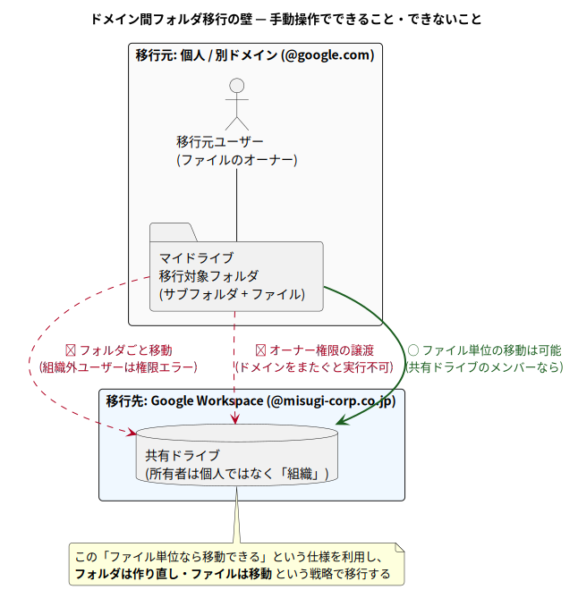
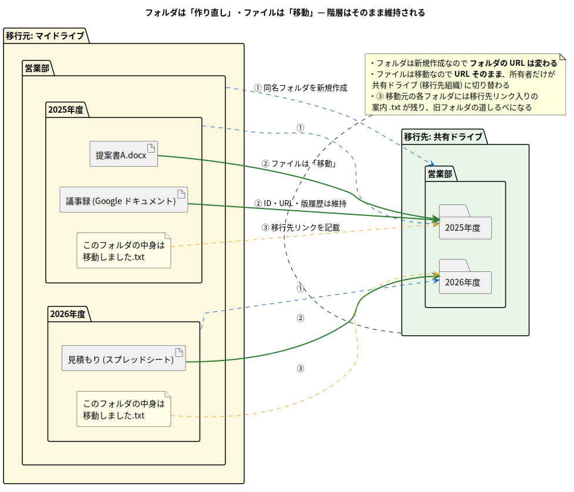

# 第0章 はじめに

[目次](./README.md) | [次章: 背景 →](./01_background.md)

このドキュメント群は、**このプロジェクトに初めて参加する人が、前提知識ゼロから
順番に読むだけで全体を理解できる**ことを目指した教科書である。Google ドライブの
仕様・移行戦略の考え方・GAS のコード・開発環境まで、一つずつ図と用語解説付きで
説明する。

## 0.1 このツールは何をするものか

`@google.com` アカウントの**マイドライブ**にあるフォルダを、別ドメイン
(`@misugi-corp.co.jp`) の Google Workspace にある**共有ドライブ**へ、
階層をそのまま保って移行する Google Apps Script (GAS) ツールである。

ドメインをまたぐと「フォルダごと移動」や「オーナー譲渡」ができないという
Google ドライブの制約があるため、**フォルダは作り直し・ファイルは1件ずつ移動**
という戦略をとる。そして**利用者はコードを一切触らず、Google スプレッドシートの
メニューと設定シートだけで操作**できる。

📖 用語解説: Google Apps Script (GAS)

Google が提供する JavaScript ベースのスクリプト実行環境。Google のサーバー上で
動き、ドライブ・スプレッドシート・Gmail などの Google サービスを、簡単な承認だけで
操作できる。<https://script.google.com> からブラウザだけで開発・実行できる。

## 0.2 対象読者

- このリポジトリに新しく参画したメンバー
- Google ドライブ / Google Apps Script (GAS) をこれから触る人
- 「なぜ普通にフォルダを移動できないのか」から知りたい人

プログラミングの基礎 (変数・関数・ループが読める程度) 以外の前提知識は仮定しない。

## 0.3 全体像を1枚で

「何が問題で、どう解決するのか」はこの2枚に集約される。

そして**利用者が触るのはスプレッドシートだけ**。操作画面の全体像はこの1枚。

## 0.4 読み方

- 各章は前の章の内容を前提に書かれているため、**上から順に読む**のがおすすめ
- 専門用語が出てきた箇所には、すぐ下に折りたたみ式の用語解説
  (▶ をクリックすると開く) を置いてある。知っている用語は読み飛ばせばよい
- 図はすべて `plantuml/` または `drawio/` のソースから生成しており、
  `mise run docs:diagrams` で再生成できる (→ [第5章](./05_dev_environment.md))

📖 用語解説: アコーディオン (折りたたみ)

まさにこの部分のこと。HTML の `
` タグで実現しており、GitHub の
Markdown 表示ではクリックで開閉できる。本文の流れを邪魔せずに補足説明を
差し込むために使っている。

## 0.5 この先の地図

| 次に読む章 | 何がわかるか |
| --- | --- |
| [第1章 背景](./01_background.md) | なぜ手動では移動できないのか (3つの仕様の壁) |
| [第2章 解決アプローチ](./02_solution_architecture.md) | どう回避するか・なぜ GAS + スプレッドシートか |
| [第3章 セットアップ](./03_setup_guide.md) | 実際に動かす手順 |

まずは次章「背景」で、そもそも何が問題なのかを押さえよう。

---

[目次](./README.md) | [次章: 背景 →](./01_background.md)
