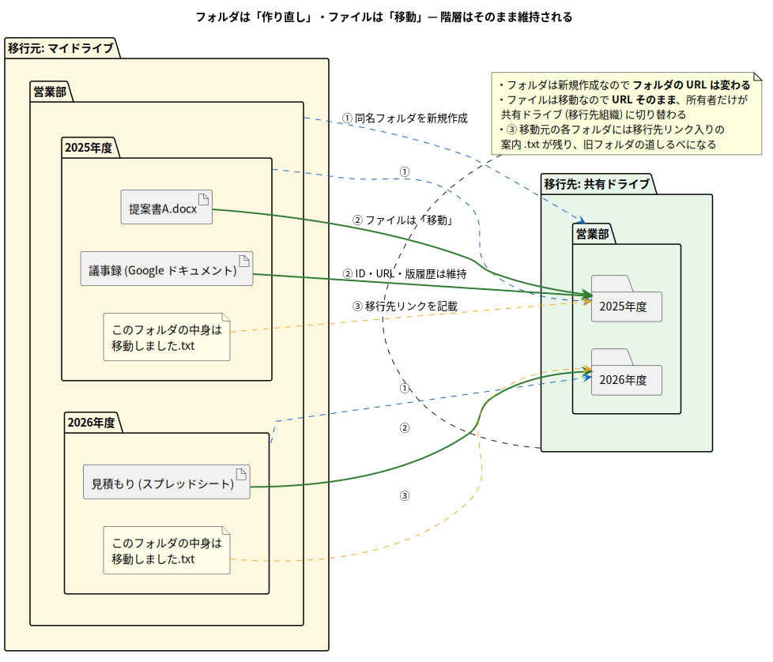
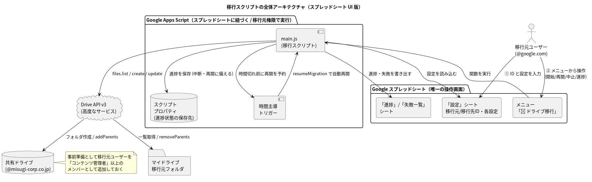
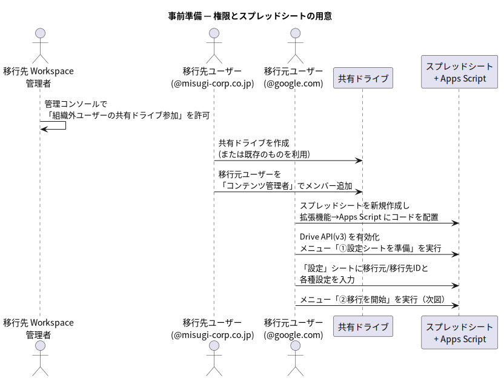

# 第2章 解決アプローチとアーキテクチャ

[← 第1章](./01-background.md) | [目次](./README.md) | [次章: セットアップ →](./03-setup-guide.md)

## 2.1 基本戦略 — フォルダは「作り直し」、ファイルは「移動」

第1章の結論をそのまま設計に落とす。

1. 移行元のフォルダ構造を上から走査し、移行先の共有ドライブに
   **同じ名前・同じ階層の空フォルダを再帰的に新規作成**する
2. 各フォルダ内の**ファイルだけを、対応する移行先フォルダへ1件ずつ移動**する
3. 移動した瞬間にファイルの所有者は共有ドライブ (移行先組織) になる —
   **所有権の問題は「移動」という操作の副作用として自動的に解決する**
4. 結果として、元のフォルダ階層がそのまま移行先に再現される

この戦略の重要な性質:

| 項目 | フォルダ | ファイル |
| --- | --- | --- |
| 移行方法 | 新規作成 (作り直し) | 移動 |
| ID / URL | **変わる** (新しいフォルダなので) | **変わらない** (同じファイルなので) |
| 版履歴・コメント | — | 維持される |
| 所有者 | 最初から共有ドライブ | 移動と同時に共有ドライブへ |

## 2.2 実現手段の比較 — なぜ GAS か

同じ戦略を実現する手段はいくつかある。比較して GAS を採用した。

| 手段 | 実現性 | 難点 |
| --- | --- | --- |
| 手動でファイルを1件ずつ移動 | ○ (仕様上は可能) | 数千ファイルでは非現実的。ミスも起きる |
| Google Takeout でダウンロード → 再アップロード | ○ | Google ドキュメント類が Office 形式等に変換され、版履歴・コメント・ファイル ID がすべて失われる |
| **Google Apps Script (GAS)** ★採用 | ◎ | 6分の実行時間制限があるが、自動中断・再開で回避できる (第4章) |
| Chrome 拡張機能 | △ (技術的には可能) | 下記参照 |
| ローカルで Drive API を直接叩くスクリプト (Python 等) | ◎ | GCP プロジェクト作成・OAuth クライアント登録・認証情報管理が必要で、準備の手数が多い |

### Chrome 拡張機能ではダメなのか?

元の要望にあった「Chrome 拡張機能で作れるならその方が良い」への回答:
**作れるが、今回の用途には向かない**。理由は次のとおり。

- 拡張機能から Drive を操作するには結局 **Drive API + OAuth 認証**が必要で、
  GCP プロジェクトの作成、OAuth クライアント ID の発行、テストユーザー登録
  (または審査) といった準備が GAS より大幅に重い
- 処理はブラウザのプロセス内で動くため、**数時間かかる移行中はブラウザ
  (と拡張機能) を開きっぱなしにする必要**があり、スリープや誤タブクローズで
  中断するリスクがある
- 配布・インストール・更新の管理が必要 (1回きりの移行にはオーバーヘッド)

一方 GAS は、Google のサーバー側で動き、**「このスクリプトに自分のドライブの
操作を許可する」という数クリックの承認だけで API が使える**。時間主導トリガー
という中断・再開の仕組みも標準装備。1回きりのドライブ移行にはこちらが最適。

📖 用語解説: Google Apps Script (GAS)

Google が提供する JavaScript ベースのスクリプト実行環境。Google のサーバー上で
動き、ドライブ・スプレッドシート・Gmail などの Google サービスを簡単な承認だけで
操作できる。<https://script.google.com> からブラウザだけで開発・実行できる。

📖 用語解説: OAuth (オーオース)

「アプリに、自分のアカウントの特定の操作だけを許可する」ための標準的な認可の
仕組み。初回実行時に出る「このアプリが Google ドライブのファイルの表示・編集を
求めています」という確認画面がまさに OAuth の承認画面。

📖 用語解説: Drive API

プログラムから Google ドライブを操作するための公式インターフェース。
ファイルの一覧取得 (`files.list`)・作成 (`files.create`)・更新/移動
(`files.update`) などの機能をもつ。GAS からは「高度なサービス」として
有効化して使う (第3章)。

## 2.3 どちらのアカウントで実行するか

移行スクリプトは**移行元アカウント (`@google.com` 側) で実行する**。これは重要な設計判断。

| 実行アカウント | できること | 判定 |
| --- | --- | --- |
| **移行元 (`@google.com`) ★採用** | 自分がオーナーのファイルをマイドライブから共有ドライブへ**移動**できる (共有ドライブのメンバーになっていれば)。ID・版履歴が維持され、所有権も移る | ⭕ |
| 移行先 (`@misugi-corp.co.jp`) | 他人 (移行元) がオーナーのファイルは移動できないため、**コピーしか手段がない**。コピーはファイル ID が変わり (旧 URL はコピー先を指さない)、版履歴・コメントも失われる | ❌ |

理由を一言で言うと: **マイドライブからファイルを持ち出せるのは、原則その
ファイルのオーナーだけ**だから。移行先アカウントは閲覧共有を受けても
「借りて見ている」立場であり、元ファイルを動かす権限がない。

## 2.4 全体アーキテクチャ

登場する構成要素:

| 構成要素 | 役割 |
| --- | --- |
| `main.js` (移行スクリプト) | 本体。フォルダ走査・フォルダ作成・ファイル移動を行う ([src/main.ts](../../src/main.ts) からビルド) |
| Drive API v3 (高度なサービス) | ドライブ操作の実体。`supportsAllDrives` オプション付きで共有ドライブを扱う |
| スクリプトプロパティ | 進捗状態 (キュー・統計・失敗一覧) の保存先。中断・再開を可能にする |
| 時間主導トリガー | GAS の実行時間制限 (約6分) を超える前に中断し、少し後に自動再開させる仕掛け |

> ✏ この図は [drawio 版](../../drawio/architecture.drawio) もあり、
> マウスでレイアウトを調整したい場合はそちらを編集する (→ [第5章](./05-dev-environment.md))。

📖 用語解説: 高度なサービス (Advanced Services)

GAS から Google の各種 API をフルスペックで使うための仕組み。GAS には
`DriveApp` という組み込みのドライブ操作サービスもあるが、共有ドライブ対応の
細かいオプション (`supportsAllDrives` など) や「親フォルダの付け替え = 移動」を
確実に制御するには、高度なサービスとして Drive API v3 を有効化して使うのが確実。

📖 用語解説: スクリプトプロパティ

GAS プロジェクトに紐づく小さな Key-Value 保存領域 (`PropertiesService`)。
スクリプトの実行が終わっても値が残るため、実行をまたいで状態を引き継ぐのに使う。
1つの値は約 9KB まで、全体で約 500KB までという制限がある (第4章で対策を説明)。

📖 用語解説: トリガー (時間主導トリガー)

「◯分後」「毎日◯時」などの条件で GAS の関数を自動実行する仕組み。
本スクリプトは「60秒後に resumeMigration を1回実行」という使い捨てトリガーを
中断のたびに仕掛けることで、人手なしの連続実行を実現している。

## 2.5 所有権はどう移るのか (要件3への回答)

このアーキテクチャで所有権の移転に**特別な操作は一切していない**ことに注意。

- 共有ドライブ内のアイテムの所有者は、仕様上つねに「共有ドライブ自体」
- したがって、ファイルを共有ドライブへ **移動 (親フォルダの付け替え) した瞬間に、
  所有者は自動的に移行元個人 → 共有ドライブ (移行先組織) へ切り替わる**
- 移行元アカウントは以後、共有ドライブのメンバー権限 (コンテンツ管理者など) で
  そのファイルにアクセスする立場になる。メンバーから外れればアクセスも切れる —
  つまり組織への移管が完全に成立する

「ドメイン間でオーナー譲渡ができない」という壁①は、譲渡ではなく
**共有ドライブへの移動**という別ルートで回避している。

## 2.6 権限設定の全体像

このアーキテクチャが動くために必要な事前の権限設定は次の流れ (詳細手順は第3章)。

ポイントは2つ:

1. 移行先 Workspace の管理者が「**組織外ユーザーの共有ドライブ参加**」を許可していること
2. 移行元アカウントが共有ドライブに「**コンテンツ管理者**」以上の役割で追加されていること
   (フォルダ作成とファイル追加の両方の権限が確実に必要なため)

📖 用語解説: コンテンツ管理者 (共有ドライブの役割)

共有ドライブのメンバー役割の一つ。上から「管理者 > コンテンツ管理者 > 投稿者 >
コメント投稿者 > 閲覧者」の順で権限が強い。コンテンツ管理者はファイル・フォルダの
追加・編集・移動・削除ができる。「投稿者」ではフォルダ作成やアイテムの移動が
制限される場合があるため、本ツールではコンテンツ管理者以上を必須とする。

---

[← 第1章](./01-background.md) | [目次](./README.md) | [次章: セットアップ →](./03-setup-guide.md)
