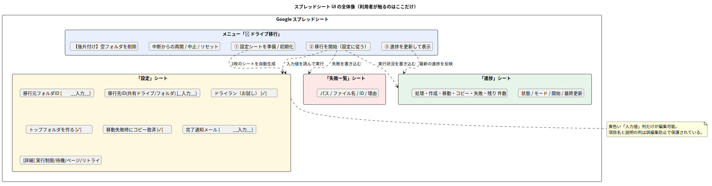

# 第3章 セットアップと実行手順

[← 第2章](./02_solution_architecture.md) | [目次](./README.md) | [次章: コード解説 →](./04_code_walkthrough.md)

この章のゴールは、**手元のコードを「スプレッドシートに紐付いた Apps Script
プロジェクト」へアップロード(push)し、シートのメニュー「📁 ドライブ移行」で
移行を実行できる状態**にすること。開発環境は [mise](https://mise.jdx.dev/) +
[pnpm](https://pnpm.io/) + [clasp](https://github.com/google/clasp) で統一する。

作業はすべてこのプロジェクトのディレクトリ (`gas-drive-migration-2026-07-11/`) 内で行う。



## 3.0 事前チェックリスト

| # | 確認事項 | 担当 | 節 |
| --- | --- | --- | --- |
| 1 | 移行先 Workspace で組織外ユーザーの共有ドライブ参加が許可されている | 移行先の管理者 | 3.1 |
| 2 | 移行先の共有ドライブが存在し、移行元アカウントが「コンテンツ管理者」で追加済み | 移行先ユーザー | 3.2 |
| 3 | mise / pnpm で依存を入れ、ビルドできる | 移行元ユーザー | 3.3〜3.5 |
| 4 | Apps Script API 有効化 + clasp ログイン | 移行元ユーザー | 3.6〜3.7 |
| 5 | `clasp create-script` でシート+プロジェクト作成 → push | 移行元ユーザー | 3.8〜3.9 |
| 6 | 設定シートに ID を入力し、ドライランで計画確認 | 移行元ユーザー | 3.11〜3.12 |

## 3.1 【移行先の管理者】組織外ユーザーの参加を許可する

移行先 (`@misugi-corp.co.jp`) の Google Workspace **特権管理者**が設定する。

1. [管理コンソール](https://admin.google.com) にログイン
2. `アプリ` → `Google Workspace` → `ドライブとドキュメント` → `共有設定` を開く
3. 対象の組織部門で以下を確認・変更する
   - **共有オプション**: 組織外との共有を「オン」にする
   - **共有ドライブの作成**: 「組織外のユーザーに共有ドライブ内のファイルへのアクセスを許可する」に相当する項目を有効にする
     (この設定が無効だと、次節でメンバー追加しようとしても移行元アカウントを追加できない)

> 💡 設定の反映には最大 24 時間かかることがある (通常は数分)。

<details>
<summary>📖 用語解説: 管理コンソール / 特権管理者</summary>

管理コンソール (admin.google.com) は Google Workspace 組織全体の設定を行う
管理者専用画面。特権管理者はその組織の最上位権限を持つアカウントで、
共有ポリシーの変更はこの権限が必要。一般ユーザーの画面には出てこない。

</details>

## 3.2 【移行先ユーザー】共有ドライブの準備とメンバー追加

移行先ドメインのユーザー (または管理者) が行う。

1. [Google ドライブ](https://drive.google.com) → 左メニュー `共有ドライブ` → 新規作成 (既存を使うならそれで良い)
2. 共有ドライブを開き、`メンバーを管理` を開く
3. 移行元アカウント (例: `xxxx@google.com`) を追加し、役割を **「コンテンツ管理者」** にする
   - 「投稿者」ではフォルダ作成・移動が制限される場合があるため不可
   - 追加できない場合は 3.1 の管理者設定が未完了
4. (必要なら) 共有ドライブ内に移行先の親フォルダを作っておく (共有ドライブ直下に置くなら不要)

以降はすべて**移行元アカウント (`@google.com` 側)** の手元 (ターミナル) で行う。

## 3.3 【移行元ユーザー】mise をインストールする

ツールバージョン管理の [mise](https://mise.jdx.dev/getting-started.html) を入れる
(導入済みならスキップ)。

```bash
curl https://mise.run | sh
```

インストール後、シェルへの組み込み(アクティベート)方法が表示されるので、案内に従って
`~/.bashrc` や `~/.zshrc` に設定を追加する。`mise --version` が表示されれば成功。

次に、このプロジェクトの `mise.toml` を信頼(trust)して、宣言されたツール
(Node.js と pnpm)をインストールする。

```bash
cd gas-drive-migration-2026-07-11
mise trust      # このディレクトリの mise.toml を信頼する(初回のみ)
mise install    # mise.toml の Node.js と pnpm が入る
mise exec -- node --version
mise exec -- pnpm --version
```

<details>
<summary>📖 用語解説: mise trust(なぜ「信頼」が必要か)</summary>

`mise.toml` には環境変数の設定や任意のタスク(シェルスクリプト)を書けるため、
悪意あるリポジトリの設定を無条件に実行すると危険。そこで mise は、初めて見る
設定ファイルを明示的に `mise trust` するまで実行しない。中身を確認してから信頼する、
という安全装置。

</details>

<details>
<summary>📖 用語解説: Node.js / npm / pnpm</summary>

**Node.js** はブラウザの外で JavaScript を実行する環境。clasp や TypeScript
コンパイラは Node.js 上で動く。パッケージ(公開ライブラリ)を取得・管理するのが
**パッケージマネージャ**で、Node.js 付属の **npm** が基本だが、本プロジェクトは
より高速で安全機能の充実した **pnpm** を採用している(理由は次節)。

</details>

## 3.4 依存パッケージをインストールする

```bash
mise run setup      # 実体: pnpm install
```

`package.json` の開発用パッケージ 3 つが `node_modules/` に入る。

| パッケージ | 役割 |
| --- | --- |
| `@google/clasp` | Apps Script へのアップロード等を行う公式 CLI (v3 系) |
| `typescript` | TypeScript コンパイラ (`tsc`) |
| `@types/google-apps-script` | `DriveApp` など GAS 固有 API の型定義 |

本プロジェクトはパッケージマネージャに **pnpm** を採用し、サプライチェーン攻撃への
防御として **「公開から 1 週間経っていないバージョンは使わない」** 設定
(`pnpm-workspace.yaml` の `minimumReleaseAge: 10080`) を入れている。

<details>
<summary>📖 用語解説: サプライチェーン攻撃 / minimumReleaseAge</summary>

**サプライチェーン攻撃**は、アプリ本体ではなく「依存パッケージ」に悪意あるコードを
混入させる攻撃。こうした悪意あるバージョンは公開から数日以内に検知・削除されることが
多いため、「新しすぎるリリースを一定期間寝かせてから使う」のが有効な防御になる。
pnpm の **`minimumReleaseAge`**(10080 分 = 7 日)はそれを自動化し、依存解決の際に
1 週間未満の新バージョンを候補から外す。緊急のセキュリティ修正だけ即時取り込みたい
場合は `minimumReleaseAgeExclude` で個別除外できる。この設定が効くのはバージョンを
**解決するとき**で、普段のインストールの再現性はロックファイル `pnpm-lock.yaml` が担う。

</details>

<details>
<summary>📖 用語解説: pnpm のもう 1 つの安全装置(スクリプトの既定ブロック)</summary>

npm パッケージはインストール時に任意のスクリプト(postinstall など)を実行でき、
これが攻撃の常套手段。pnpm v10 以降は**依存パッケージのインストールスクリプトを
既定で実行しない**。本プロジェクトの依存はスクリプト実行を必要としないため、
この既定のまま使える。

</details>

<details>
<summary>📖 補足: uuid の deprecation 警告と overrides</summary>

`@google/clasp` は内部で Google の認証ライブラリ経由に非サポートの `uuid@9`
(deprecated) を引き込むため、そのままだとインストール時に deprecation 警告が出る。
`pnpm-workspace.yaml` の `overrides` でサポート中の `uuid@11`(API 互換)に上書きして
警告を解消している。いずれも**開発時に使う clasp の依存**で、GAS 上で動く成果物
(`dist/main.js`)には含まれないため、動作への影響はない。

</details>

## 3.5 ビルドする

コードが正しくコンパイルできることを確認する。

```bash
mise run build      # 実体: pnpm run build (tsc + マニフェストのコピー)
```

成功すると `dist/` に次が生成される。**アップロードされるのは常にこの `dist/`
の中身**。`src/main.ts`(TypeScript)を編集 → `mise run build` で `dist/main.js`
を再生成、という流れになる。

```
dist/
├── appsscript.json   # マニフェスト (src/ からコピー)
└── main.js           # src/main.ts をコンパイルした JavaScript
```

## 3.6 Apps Script API を有効にする(重要・初回のみ)

clasp が Google のサーバーと通信するには、**自分のアカウントで Apps Script API の
利用を許可**しておく必要がある。ブラウザで次を開き「Google Apps Script API」を
**オン**にする。

> <https://script.google.com/home/usersettings>

これを忘れると、後の `clasp push` / `create-script` で
`User has not enabled the Apps Script API` エラーになる(有効化後、反映まで数分
かかることがある)。

## 3.7 clasp でログインする

```bash
mise run login      # 実体: pnpm exec clasp login
```

ブラウザが開き Google の認証画面が出る。**移行元アカウント (`@google.com` 側)**
でログインし、clasp に権限を許可する。認証情報は `~/.clasprc.json` に保存される。
SSH 先などブラウザを開けない環境では次を使う。

```bash
pnpm exec clasp login --no-localhost
```

<details>
<summary>📖 用語解説: OAuth(オーオース)</summary>

パスワードを直接渡さずに「このアプリに、私のアカウントのこの操作だけを許可する」を
実現する標準的な認可の仕組み。`clasp login` はまさに OAuth のフローで、許可の範囲は
**スコープ**という単位で指定される。

</details>

## 3.8 スプレッドシートとプロジェクトを作る

本ツールのインターフェースはスプレッドシートなので、アップロード先は
**スプレッドシートに紐付いた(コンテナバインドの)Apps Script プロジェクト**。
**A・B どちらか一方**を実施する。

<details>
<summary>📖 用語解説: コンテナバインド / スタンドアロン</summary>

Apps Script には単体で存在する「スタンドアロン型」と、スプレッドシートなどの
「入れ物(コンテナ)」に紐付いた「**コンテナバインド型**」がある。バインド型は
入れ物の UI(カスタムメニューやダイアログ)を拡張でき、スクリプトから自分の
入れ物(シート)へ直接アクセスできる。本ツールは設定・進捗・メニューをシートに
置くため、バインド型で作る。

</details>

### 方法 A: シートごと新規作成する(おすすめ)

```bash
mise run build      # 先に dist/ を作っておく
pnpm exec clasp create-script --type sheets --title "ドライブ移行ツール" --rootDir dist
```

`--type sheets` により、**新しいスプレッドシートと、それにバインドされた
プロジェクト**が一度に作られ、手元に接続情報ファイル `.clasp.json` が生成される。
出力される Google Sheets の URL は後で使うので控えておく。

> 補足: clasp v3 では `create-script` が正式名で、`create` はその別名(エイリアス)。
> `mise run create-sheet` でも同じコマンドを実行できる(タイトル既定は「ドライブ移行ツール」)。

### 方法 B: 既存のスプレッドシートに紐付ける

1. 対象のスプレッドシートを開き、**拡張機能 → Apps Script** でバインドプロジェクトを作成
2. エディタの「プロジェクトの設定」(⚙) から**スクリプト ID** をコピー
3. 見本ファイルをコピーして ID を書き込む

```bash
cp .clasp.json.example .clasp.json
# .clasp.json の scriptId を自分の ID に書き換える
```

```json
{
  "scriptId": "1AbCdEfGh...(自分のスクリプト ID)",
  "rootDir": "dist"
}
```

<details>
<summary>📖 用語解説: スクリプト ID / .clasp.json</summary>

**スクリプト ID** は Apps Script プロジェクトを一意に識別する文字列(エディタ URL
`script.google.com/.../projects/【この部分】/edit` にも含まれる)。**`.clasp.json`**
は「このディレクトリのコードを、どのプロジェクトの、どのフォルダ(`rootDir`)から
アップロードするか」を clasp に伝える設定。スクリプト ID は人それぞれ違うため
Git にはコミットせず(`.gitignore` 済み)、雛形 `.clasp.json.example` を配っている。

</details>

## 3.9 push する(初回デプロイ)

```bash
mise run push       # 実体: ビルド → pnpm exec clasp push
```

初回はマニフェスト(`appsscript.json`)の上書き確認を聞かれることがある。手元の
マニフェストが正なので **`y`** で進む。`dist/appsscript.json` と `dist/main.js` が
アップロードされれば成功。

<details>
<summary>📖 用語解説: マニフェスト (appsscript.json)</summary>

プロジェクトの実行環境を宣言する設定ファイル。タイムゾーン、ランタイム(V8)、
使用する高度なサービス(Drive API v3)、そして**要求する OAuth スコープの一覧**などが
書かれている。中身は[第4章](./04_code_walkthrough.md)で解説する。

</details>

<details>
<summary>📖 開発環境を用意できない場合(コピペ)</summary>

mise/pnpm/clasp を使わず、ブラウザだけで済ませることもできる。移行元アカウントで
<https://sheets.new> を開き `拡張機能 → Apps Script` を開いて、
[`dist/main.js`](../../dist/main.js) を `コード.gs` に貼り付け、`プロジェクトの設定`
→ マニフェストを表示して [`dist/appsscript.json`](../../dist/appsscript.json) の内容で
置き換える。以降 (3.10〜) は同じ。

</details>

## 3.10 動作確認とシートメニューの表示

バインド先のスプレッドシートを開く(方法 A なら `create-script` が表示した URL、
または Drive から)。数秒待つとメニューバーに **「📁 ドライブ移行」** が現れれば
デプロイ成功(出ないときは再読み込み)。

続いて **「📁 ドライブ移行」→「① 設定シートを準備 / 初期化」** を実行する。
初回は**このスクリプトへの権限の承認**を求められる。

1. 「承認が必要です」→ アカウントを選択
2. 「このアプリは Google で確認されていません」警告 → `詳細` →
   `(プロジェクト名)(安全ではないページ) に移動` → 内容を確認して `許可`
3. もう一度「① 設定シートを準備」を実行すると「設定」「進捗」「失敗一覧」
   「スキップ一覧」の 4 シートが自動生成される

<details>
<summary>📖 用語解説: onOpen / カスタムメニュー</summary>

`onOpen` はスプレッドシートを開いた瞬間に自動実行される特殊関数。この中で
`SpreadsheetApp.getUi().createMenu(...)` を呼ぶとメニューバーに独自メニューを
追加できる。これが利用者にとっての「実行ボタン」になる。

</details>

<details>
<summary>📖 用語解説: 「このアプリは Google で確認されていません」警告</summary>

Google の審査を受けていない OAuth アプリに出る標準の警告。ストア公開アプリでは
ないから出るだけで、コードは自分の手元にある本リポジトリのものなので、内容を
確認した上で許可すればよい。逆に言えば、**出所不明のスクリプトにこの承認を
与えてはいけない**(ドライブ全体を操作できる権限のため)。

</details>

> 💡 コードを直接確認したいときは `mise run open`(実体: `pnpm exec clasp open-script`)
> で Apps Script エディタが開く。手元の `main.js` は Apps Script 上では `.gs` として
> 表示される(中身は同じ)。

## 3.11 「設定」シートに入力する

「設定」シートの**黄色い「入力値」列 (B列) だけ**を編集する(項目名と説明の列は
誤編集防止で保護されている)。各項目の意味:

| 設定項目 | 必須 | 説明 |
| --- | --- | --- |
| 移行元フォルダID | ★ | マイドライブで対象フォルダを開いた URL `https://drive.google.com/drive/folders/`**`1AbCdEfGh...`** の太字部分 |
| 移行先ID（共有ドライブ or フォルダ） | ★ | 共有ドライブそのものの ID (直下へ置く場合) でも、共有ドライブ内フォルダの ID でもよい。URL の `folders/` 以降。マイドライブ内は安全装置でエラー |
| ドライラン（お試し・変更なし） | | チェック中は**一切変更せず**、実行予定の操作を「進捗」シートとログに出すだけ。まずONで確認し、本実行時にOFF |
| 移行先にトップフォルダを作る | | チェック: 移行先に移行元と同名のトップフォルダを作りその中へ移行 / OFF: 移行先フォルダ直下へ中身を直接展開 |
| 移動失敗時にコピーで救済 | | **自分が所有する**ファイルの移動がまれに失敗したときコピーで救済するか。既定ON。コピーはファイル ID が変わる点に注意。※**他人所有ファイルはそもそも処理せずスキップ**する(救済対象外 → [3.17](#317-他人所有ファイルはスキップされる)) |
| コピー救済後に元ファイルを削除 | | コピー救済後、元ファイル(自分所有)をゴミ箱に入れるか。既定OFF (残す) |
| 移動元に案内ファイル(.txt)を残す | | 各フォルダの中身を移動後、移動元に「このフォルダの中身は移動しました.txt」を作り移行先リンクを記載。既定ON (→ [3.16](#316-移動元に残る案内ファイル)) |
| 完了通知メール（空欄可） | | 完了・エラー停止時の通知先メールアドレス。空欄なら通知しない |
| [詳細] 1回の実行制限（ミリ秒） | | 既定 270000 (=4.5分)。GAS の上限約6分より手前で自動中断するため。通常変更不要 |
| [詳細] 自動再開までの待機（ミリ秒） | | 既定 60000 (=60秒)。通常変更不要 |
| [詳細] 一覧取得のページ件数 | | 最大1000。既定1000。通常変更不要 |
| [詳細] API リトライ回数 | | 既定5。通常変更不要 |

> 💡 チェックボックスの項目は □/☑ をクリックで切り替える。

<details>
<summary>📖 用語解説: チェックボックス / 保護 (警告付き)</summary>

真偽値の項目にはスプレッドシートの「チェックボックス」機能 (`insertCheckboxes()`) を
使っている。ON なら `TRUE`、OFF なら `FALSE` がセルの値になる。項目名・説明の列は
「範囲の保護 (警告のみ)」を掛けており、間違って編集しようとすると警告が出る
(完全禁止ではなく注意喚起)。

</details>

## 3.12 ドライランで計画を確認する

1. 「設定」で**「ドライラン」にチェック**が入っていることを確認
2. メニュー **「② 移行を開始（設定シートに従う）」**
3. 確認ダイアログで移行元・移行先・モードを確認して `OK`
4. 「進捗」シートに作成予定フォルダ数・移動予定ファイル数が反映される
   (詳しい `[DRY_RUN]` 明細は `mise run open` で開くエディタの実行ログにも出る)
5. 件数や階層がイメージ通りか確認する

## 3.13 本実行する

1. 「設定」の**「ドライラン」のチェックを外す**
2. もう一度 **「② 移行を開始」**。確認ダイアログに「★本実行」と表示される → `OK`
3. あとは自動で進む:
   - 約4.5分ごとに自動中断し、約60秒後に自動再開(何もしなくてよい)
   - 進捗は「進捗」シートにほぼリアルタイム更新。手動最新化は **「③ 進捗を更新して表示」**
   - 完了すると `完了通知メール` にレポートが届く(設定時)+ 完了トースト

> ⚠ 実行中は移行元フォルダ内のファイルの追加・移動を控えること。完了後にもう一度
> 「② 移行を開始」すれば、べき等性(第4章)により残っている分だけが移行される。

途中操作:

| やりたいこと | メニュー操作 |
| --- | --- |
| 一時停止 → 後で続き | **放置でよい**(自動中断される)。手動再開は「中断からの再開」 |
| 完全に中止 | 「移行を中止」(移動済みファイルはそのまま残る) |
| 状態を消してやり直し | 「状態をリセット（最初から）」→「② 移行を開始」 |

## 3.14 完了確認と検証

1. 「進捗」シートで `状態: DONE`、`失敗（合計）: 0` が理想。失敗があれば
   その下の**種類別内訳**で当たりをつける
2. 失敗があれば「失敗一覧」シート(「種別」列つき)の理由を確認(対処法は [第6章](./06_operations.md))
3. **「スキップ（他人所有）」が 0 でなければ「スキップ一覧」シートを確認** — 他人所有で
   移行できず移動元に残ったファイル。所有者に対応を依頼する等 (→ [3.17](#317-他人所有ファイルはスキップされる))
4. 移行元フォルダに (自分がオーナーの) ファイルが残っていないことを確認
5. 移行先の共有ドライブで階層とファイルを開いて確認

## 3.15 後片付け(任意)

移行後、移行元には**空のフォルダの殻**が残る(フォルダは移動ではなく作り直しのため)。
きれいにしたければ:

1. 「ドライラン」ON のまま メニュー「【後片付け】空フォルダを削除」で削除予定を確認
2. 「ドライラン」OFF にして再実行

このユーティリティは**完全に空のフォルダしかゴミ箱に入れない**ため、移行漏れファイルを
巻き込む心配はない(案内ファイルだけが残るフォルダは「空」とみなして案内ごと片付ける)。

## 3.16 移動元に残る案内ファイル

**「移動元に案内ファイル(.txt)を残す」** 設定 (既定 ON) が有効だと、各フォルダの
中身を移動したあと、その移動元フォルダに次の内容の
**「このフォルダの中身は移動しました.txt」** が作られる。

```text
このフォルダの中身は別の場所へ移動しました。

▼ 移行先フォルダ
https://drive.google.com/drive/folders/1AbCdEf...

移行日時: 2026-07-16 15:30

※このファイルは移行ツールが自動生成した案内です。
※ドメインをまたぐ制約でフォルダ自体は移動できないため、
  中身のファイルのみを移行先へ移動し、この案内を移動元に残しています。
```

ドメイン間ではフォルダ自体を移動できず、移動元にはフォルダの「殻」が残る。
その殻を開いた人に**「中身はどこへ行ったのか」を伝える道しるべ**になる。

- この案内ファイル自身は**移行先へは移動されない**(移動元に残る目印のため)。
  再実行しても移動されず、内容だけが最新のリンク・日時に更新される(冪等)
- ドライラン中は作成されず、作成予定だけがログに出る
- 「【後片付け】空フォルダを削除」を実行すると、案内ファイルだけが残るフォルダは
  「空」とみなされ、案内ファイルごとゴミ箱に入る

<details>
<summary>📖 用語解説: なぜ Google ドキュメントでなく .txt なのか</summary>

要件が「.txt にリンクを書いて置く」であるため、素のテキストファイル
(`text/plain`) を作成している。Drive のプレビューでリンクはクリックできないが、
コピーして開けば移行先へ辿れる。クリック可能にしたい場合は Google ドキュメントで
作る拡張も可能(本ツールでは非採用)。

</details>

## 3.17 他人所有ファイルはスキップされる

自分が**所有していない**ファイル(共有されて自分のフォルダに入っているだけの
ファイル等)は、**移動もコピーもせずスキップ**し、移動元にそのまま残す。
勝手に複製を作らず、後から気づけるように記録する方針。

- 件数は「進捗」シートの **「スキップ（他人所有）」** に集計される
- 明細(パス / ファイル名 / **所有者** / ファイルID)は **「スキップ一覧」シート**に出る
- ドライランでも同様にスキップ対象として集計・一覧される(実ファイルには触れない)
- 対処: 所有者にそのファイルの移行を依頼するか、オーナー権限を受け取ってから再実行する

詳しい考え方は [第6章 6.6](./06_operations.md#66-他人所有ファイルはスキップされる)。

---

[← 第2章](./02_solution_architecture.md) | [目次](./README.md) | [次章: コード解説 →](./04_code_walkthrough.md)
