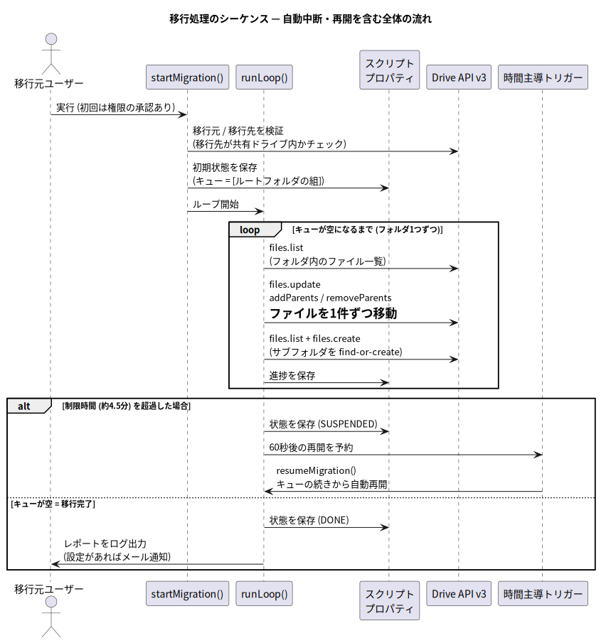
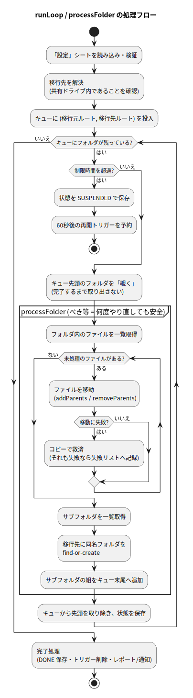
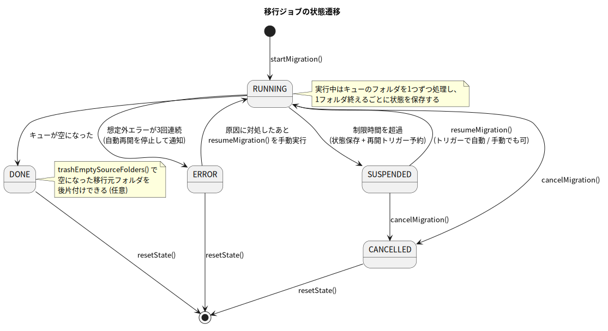

# 第4章 コード解説

[← 第3章](./03-setup-guide.md) | [目次](./README.md) | [次章: 開発環境 →](./05-dev-environment.md)

この章ではソースコード [`src/main.ts`](../../src/main.ts) の設計と実装を読み解く。
コードは大きく **「スプレッドシート UI 層」** と **「移行エンジン層」** に分かれ、
次のセクション構成になっている。

| 層 | セクション | 内容 |
| --- | --- | --- |
| UI | スプレッドシート UI 定義 | 設定項目 `SETTING_DEFS`・シート名などの定義 |
| UI | メニュー | `onOpen` / `setupSheets` / `showHelp` |
| UI | エントリポイント | メニュー・トリガーから実行する関数群 |
| UI | 設定シートの読み込み | `loadConfig_` — セル値を型付き設定に変換 |
| UI | シートの構築 | `buildSettingsSheet_` など3枚のシート生成 |
| UI | 進捗シートへの書き出し | `writeStatusToSheet_` |
| エンジン | メインループ | `runLoop_` / `processFolder_` — 心臓部 |
| エンジン | Drive 操作 | 一覧取得・フォルダ作成・ファイル移動 |
| エンジン | 中断・再開 | トリガー管理 |
| エンジン | 状態の保存と読み込み | スクリプトプロパティへのチャンク保存 |
| 共通 | ユーティリティ | UI ヘルパー・リトライ・ログ・レポートなど |

> 💡 GAS の慣習として、エディタの実行メニューに出したくない内部関数には
> 名前の末尾に `_` を付けている (例: `runLoop_`)。末尾 `_` の関数は
> GAS 上で実行対象として選べず、カスタムメニューからも呼べない。逆に
> `startMigration` など**メニューやトリガーから呼ぶ関数は末尾 `_` を付けない**。

## 4.1 処理の全体像

まずシーケンス図で全体の流れをつかむ。



利用者がメニューから `startMigration` を呼ぶと、`loadConfig_` が「設定」シートを
読み、検証と初期化を行い、`runLoop_` がキューを消化する。時間切れになったら
トリガーに引き継ぎ、`resumeMigration` が続きを実行する。進捗は随時
`writeStatusToSheet_` が「進捗」シートへ書き出す。

## 4.0 UI 層 — スプレッドシートを唯一の窓口にする

利用者がコードを触らずに済むよう、設定も操作も結果表示もすべて
スプレッドシート上で行う。UI 層はそのための薄いラッパーである。

### 設定は「定義の配列」から自動生成する

設定項目は `SETTING_DEFS` という配列に一元定義している。ここに1要素足すだけで、
設定シートの行・チェックボックス・検証・`Config` への読み込みまで自動的に増える
(項目を増やしやすい設計)。

```typescript
const SETTING_DEFS: SettingDef[] = [
  { key: 'SOURCE_FOLDER_ID', label: '移行元フォルダID', type: 'string',  default: '',   required: true, description: '...' },
  { key: 'DRY_RUN',          label: 'ドライラン（お試し・変更なし）', type: 'boolean', default: true,  description: '...' },
  // ... 以下、全設定項目
];
```

`loadConfig_` は「設定」シートを走査し、A列のラベルをキーに B列の値を拾って、
型 (`string`/`boolean`/`number`) に応じて変換 (`coerceValue_`) し、必須項目が空なら
分かりやすいエラーを投げる。コード内に散らばっていた旧 `CONFIG` 定数は廃止され、
**設定の出どころはスプレッドシート1か所**になった。

<details>
<summary>📖 用語解説: onOpen / カスタムメニュー / トースト</summary>

`onOpen` はシートを開くと自動実行される特殊関数で、ここで
`createMenu('📁 ドライブ移行')...addItem('②移行を開始', 'startMigration')` のように
メニューを組み立てる。`addItem(ラベル, 関数名)` の関数名が、クリック時に実行
される関数。処理の合図には `SpreadsheetApp.getActiveSpreadsheet().toast(...)`
(画面右下に数秒出る小さな通知=トースト) を使っている。

</details>

### トリガー実行では UI を触らないこと

`resumeMigration` は時間主導トリガー (画面のない文脈) から呼ばれる。そこで
`SpreadsheetApp.getUi()` を呼ぶと例外になる。これを避けるため、UI 操作は
`getUiOrNull_()` (UI が無ければ `null` を返す) と `toast_()` (失敗を握りつぶす)
で包み、**トリガー経路では UI に触れない**設計にしている。設定シートの読み込みや
進捗シートへの書き込みは、コンテナバインドのおかげでトリガー実行時も
`getActiveSpreadsheet()` 経由で問題なく行える。

## 4.2 データ構造 — 「フォルダの対応」をキューで持つ

移行の進捗は、次の `MigrationState` 1個にすべて集約されている。

```typescript
/** 「移行元フォルダ src の中身を、移行先フォルダ dst へ移す」という作業単位 */
interface FolderTask {
  src: string;   // 移行元フォルダ ID
  dst: string;   // 対応する移行先フォルダ ID
  path: string;  // ログ用のパス表記 (例: '営業部/2026年度')
}

interface MigrationState {
  status: 'RUNNING' | 'SUSPENDED' | 'DONE' | 'CANCELLED' | 'ERROR';
  dryRun: boolean;        // このジョブが DRY_RUN として開始されたか
  queue: FolderTask[];    // これから処理するフォルダの待ち行列
  stats: MigrationStats;  // 統計 (移動数・失敗数など)
  failures: FailureRecord[];
  errorStreak: number;    // 想定外エラーの連続回数
  startedAt: string;
  updatedAt: string;
}
```

ポイントは **`queue` (待ち行列)**。「このフォルダの中身を、この移行先フォルダへ」
という組を並べておき、先頭から1つずつ処理する。処理中にサブフォルダが見つかったら、
対応する移行先フォルダを作った上で、その組を**キューの末尾に追加**する。
これは木構造の**幅優先探索 (BFS)** にあたる。

<details>
<summary>📖 用語解説: キュー (queue) / 幅優先探索 (BFS)</summary>

キューは「先に入れたものを先に取り出す」待ち行列型のデータ構造。
幅優先探索 (Breadth-First Search) は木構造を「浅い階層から順に」たどる探索方法で、
キューを使うと自然に実装できる。対になる概念は深さ優先探索 (DFS) で、
こちらは再帰呼び出しで実装されることが多い。

</details>

### なぜ再帰 (DFS) ではなくキュー (BFS) なのか

フォルダ走査といえば再帰関数が定石だが、ここでは使えない事情がある。
GAS には**1回の実行が約6分まで**という制限があり、大きなフォルダ木は
1回で処理しきれない。つまり**途中経過を保存して、次の実行で続きから再開**
できる必要がある。

- 再帰の場合: 「どこまで処理したか」は関数呼び出しの積み重ね (コールスタック)
  の中にあり、**実行が終わると消えてしまう。保存できない**
- キューの場合: 「残りの作業一覧」がただの配列なので、
  **JSON にしてスクリプトプロパティへ保存できる**。読み込めばその場から再開できる

<details>
<summary>📖 用語解説: コールスタック / JSON / シリアライズ</summary>

コールスタックは「どの関数がどの関数を呼び出し中か」をランタイムが管理する領域で、
プログラム終了とともに消える。JSON はデータを文字列で表現する標準形式。
オブジェクトを保存・通信できる形式に変換することをシリアライズと呼ぶ。
`JSON.stringify(state)` がシリアライズ、`JSON.parse(json)` がその逆。

</details>

## 4.3 メインループの動き



`runLoop_` は次を繰り返す:

1. 制限時間 (`TIME_LIMIT_MS` = 4.5分) を超えていたら、状態を保存して
   再開トリガーを予約し、実行を終える
2. キュー**先頭のタスクを「覗く」** (まだ取り出さない)
3. `processFolder_` で1フォルダ分の処理を行う
   - ① フォルダ内の**ファイルを1件ずつ移動** (時間切れならそこで中断)
   - ② サブフォルダを列挙し、移行先に同名フォルダを **find-or-create**
   - ③ サブフォルダの組をキュー末尾へ追加
4. 完了して初めてキューから取り出し、状態を保存する

## 4.4 べき等性 — 「何度やり直しても安全」の作り方

このスクリプトの設計で最も重要な性質が**べき等性**である。

<details>
<summary>📖 用語解説: べき等 (idempotent)</summary>

同じ操作を1回実行しても複数回実行しても、結果が同じになる性質。
中断・再開・リトライが絡む処理では、「途中まで終わった状態でもう一度最初から
実行されても、二重処理や壊れた状態にならない」ことを保証するための基本戦略。

</details>

中断はいつでも起こりうる (時間切れ・ネットワークエラー・ユーザーによる停止)。
そこで「同じフォルダをもう一度処理しても壊れない」よう、次の3つを徹底している。

| 仕掛け | 実装 | 効果 |
| --- | --- | --- |
| find-or-create | `ensureFolder_` は作成前に**同名フォルダを検索**し、あれば再利用する | 再実行してもフォルダが二重にできない |
| 移動 = 消える | 移動済みファイルは移行元の一覧から消えるため、再実行時は**残りだけ**が対象になる | ファイルが二重に処理されない |
| 覗いてから取り除く | キュー先頭は処理が**完了してから** `shift()` する。途中中断ならキューに残ったまま | 中断したフォルダは次回まるごとやり直される (上2つのおかげで安全) |

この結果、**万一状態が消えても `startMigration` をもう一度実行すれば
「未移行の分だけ」が移行される**。移行中に移行元へ追加されたファイルも、
再実行で拾える。

## 4.5 ファイル移動の実装 — 「移動」とは親の付け替え

Drive API に「move」という操作は存在しない。移動の実体は
**親フォルダの付け替え**である。`moveOneFile_` の核心部分:

```typescript
Drive.Files.update({}, file.id, null, {
  addParents: task.dst,     // 移行先フォルダを親に追加
  removeParents: task.src,  // 移行元フォルダを親から外す
  supportsAllDrives: true,  // 共有ドライブを扱うおまじない (必須)
  fields: 'id, parents',
});
```

- `addParents` / `removeParents` を同時に指定する = アトミックな移動
- 移動先が共有ドライブなので、この瞬間に**所有者が共有ドライブへ切り替わる**
- `supportsAllDrives: true` は「このアプリは共有ドライブを理解している」という
  宣言で、共有ドライブ絡みのほぼ全 API 呼び出しに必要。付け忘れると
  共有ドライブのアイテムが「存在しない」ように見える (定番のハマりどころ)

<details>
<summary>📖 用語解説: 親 (parents)</summary>

Drive では「ファイルがどのフォルダに入っているか」を、ファイル側が持つ
`parents` (親フォルダ ID) で表現する。フォルダがファイルを持つのではなく、
ファイルが所属先を指す、という向きであることに注意。

</details>

一覧取得 (`listChildren_`) はクエリ `q` で親を指定し、`nextPageToken` を使って
全ページを読み切る。

```typescript
Drive.Files.list({
  q: `'${parentId}' in parents and trashed = false and mimeType != '${FOLDER_MIME}'`,
  pageSize: 1000,
  pageToken: pageToken,
  fields: 'nextPageToken, files(id, name, mimeType, ownedByMe)',
  includeItemsFromAllDrives: true,
  supportsAllDrives: true,
});
```

<details>
<summary>📖 用語解説: ページネーション / MIME タイプ</summary>

一覧系 API は結果を一度に全部返さず、1ページずつ返す (ページネーション)。
レスポンスの `nextPageToken` を次のリクエストに渡すと続きが取れ、
トークンが無くなったら終端。MIME タイプはファイルの種類を表す文字列で、
Drive ではフォルダも「`application/vnd.google-apps.folder` という MIME タイプの
特殊なファイル」として扱われる。フォルダとファイルの区別はこれで行う。

</details>

## 4.6 エラー処理の3層構え

移行は数千回の API 呼び出しになるため、エラーは「起きる前提」で設計する。

```text
第1層: withRetry_        一時エラー (429/500/503 等) → 指数バックオフで最大5回リトライ
第2層: COPY_FALLBACK     移動が恒久的に失敗 (他人がオーナー等) → コピーで救済
第3層: recordFailure_    それでもダメ → 失敗リストに記録して続行 (全体は止めない)
```

- **第1層**: `withRetry_` はエラーメッセージからレート制限・サーバーエラーを判定し、
  1→2→4→8→16秒 + ランダムのゆらぎを挟んで再試行する。権限不足などリトライで
  直らないエラーは即座に投げ直す
- **第2層**: 他人がオーナーのファイルはオーナーしか移動できないため、
  `files.copy` で移行先へコピーする (コピーの所有者は共有ドライブになる)。
  ただし**コピーはファイル ID が変わる**ので、救済されたファイルは旧 URL が
  移行先を指さない。レポートで区別して報告される
- **第3層**: 1ファイルの失敗で全体を止めず、`failures` に記録して先へ進む。
  最後のレポートで失敗一覧を確認し、個別に対処する

さらに`runLoop_` 全体を覆う「最後の砦」として、想定外エラーが**3回連続**したら
自動再開を止めて `ERROR` 状態で停止し、メール通知する (無限リトライ暴走の防止)。

<details>
<summary>📖 用語解説: 指数バックオフ / レート制限</summary>

レート制限は「一定時間あたりの API 呼び出し回数の上限」。超えると 429 などの
エラーが返る。指数バックオフは、リトライのたびに待ち時間を2倍ずつ延ばす標準的な
再試行戦略で、混雑がおさまるのを待ちながらサーバーに負荷をかけない。
ランダムのゆらぎ (ジッター) を足すのは、複数の処理が同時に同じ間隔で
リトライして再衝突するのを避けるため。

</details>

## 4.7 6分制限との戦い — 状態遷移



| 状態 | 意味 |
| --- | --- |
| `RUNNING` | 実行中 |
| `SUSPENDED` | 時間切れで中断中。再開トリガーが予約済み |
| `DONE` | 完了 |
| `CANCELLED` | `cancelMigration` で中止 |
| `ERROR` | 想定外エラー3連続で自動再開を停止。対処後に `resumeMigration` で復帰 |

トリガーまわりの実装で注意した点:

- 再開トリガーは**使い捨て** (`after(60秒)`)。`resumeMigration` の冒頭で
  自分を呼んだ種類のトリガーを毎回削除するので、トリガーが溜まっていかない
- `scheduleResume_` も予約前に既存トリガーを消す (二重予約防止)

## 4.8 状態のチャンク保存 — 9KB 制限の回避

スクリプトプロパティは**1つの値につき約 9KB** までしか保存できない。
フォルダ数が多いとキューの JSON がこれを超えるため、`saveState_` は JSON を
8000文字ごとに分割し、`MIGRATION_STATE_CHUNK_0, _1, ...` という複数キーに
分けて保存する。チャンク数はメタキー (`MIGRATION_STATE_META`) に記録し、
読み込み時 (`loadState_`) に連結して復元する。

```text
MigrationState ──JSON.stringify──▶ "{...長い文字列...}"
                                     │ 8000文字ごとに分割
                                     ▼
  MIGRATION_STATE_META    = {"chunkCount": 3}
  MIGRATION_STATE_CHUNK_0 = "{"status":"RUNNING","dryRun":false,...
  MIGRATION_STATE_CHUNK_1 = ...つづき...
  MIGRATION_STATE_CHUNK_2 = ...つづき..."
```

保存のたびに前回より減ったチャンクの残骸も掃除する。それでも全体上限
(約500KB、安全マージンで 400,000 文字) を超える規模の場合は、明確なエラーで
停止して「サブフォルダ単位での分割実行」を促す。

## 4.9 関数リファレンス

### メニュー / トリガーから実行する関数 (エントリポイント)

いずれも末尾に `_` が付かず、カスタムメニューまたはトリガーから呼ばれる。

| 関数 | メニュー項目 | 役割 |
| --- | --- | --- |
| `onOpen()` | (自動) | シートを開くとメニュー「📁 ドライブ移行」を追加する |
| `setupSheets()` | ① 設定シートを準備 / 初期化 | 設定・進捗・失敗一覧の3シートを生成 (既存の入力値は保持) |
| `startMigration()` | ② 移行を開始 | 設定を読んで検証・確認ダイアログ後に開始。進行中ジョブがあれば拒否 |
| `showStatus()` | ③ 進捗を更新して表示 | 現在の状態を進捗/失敗一覧シートへ書き出し表示 |
| `resumeMigration()` | 中断からの再開 | 中断からの再開。トリガーが自動で呼ぶ。`ERROR` 復帰にも使う |
| `cancelMigration()` | 移行を中止 | 中止。トリガーを消し状態を `CANCELLED` に |
| `resetState()` | 状態をリセット | 状態とトリガーを消し、進捗/失敗一覧シートを初期化 |
| `trashEmptySourceFolders()` | 【後片付け】空フォルダを削除 | 完全に空のフォルダだけをゴミ箱へ |
| `showHelp()` | ヘルプを表示 | 使い方の要約をダイアログ表示 |

### 主な内部関数

| 関数 | 役割 |
| --- | --- |
| `loadConfig_()` | 「設定」シートを読み `Config` を構築・検証。`cfg_()` がキャッシュを提供 |
| `coerceValue_(raw, def)` | セル値を設定項目の型 (string/boolean/number) に変換 |
| `buildSettingsSheet_ / buildStatusSheet_ / buildFailuresSheet_` | 各シートの生成・書式・保護 |
| `writeStatusToSheet_(state)` | 進捗・失敗一覧シートへ状態を書き出す (`maybeWriteStatus_` が間引く) |
| `getUiOrNull_ / confirm_ / alertOrLog_ / toast_` | UI ヘルパー (トリガー実行時は安全に無効化) |
| `runLoop_(state)` | メインループ。時間管理と完了処理・エラー3連続の停止判定 |
| `processFolder_(task, state, deadline)` | 1フォルダ分の処理 (ファイル移動 → サブフォルダ作成 → キュー追加) |
| `resolveDestination_(id)` | 移行先 ID の検証。共有ドライブ ID / フォルダ ID の両対応、マイドライブ指定はエラー |
| `listChildren_(parentId, filter)` | 子アイテム全件取得 (ページネーション対応) |
| `ensureFolder_(name, parent, ...)` | find-or-create でフォルダを用意 |
| `moveOneFile_(file, task, state)` | 移動 → 失敗ならコピー救済 → それも失敗なら記録 |
| `leaveBreadcrumb_(task, state)` | 移動元フォルダに移行先リンク入りの案内 .txt を残す (冪等)。この名前のファイルは移動対象から除外 |
| `saveState_ / loadState_ / clearStateStorage_` | 状態のチャンク保存・復元・削除 |
| `withRetry_(label, fn)` | 指数バックオフ付きリトライ |
| `suspendAndScheduleResume_ / scheduleResume_ / deleteResumeTriggers_` | 中断とトリガー管理 |
| `buildReport_(state) / notify_(subject, body)` | レポート生成とメール通知 |

---

[← 第3章](./03-setup-guide.md) | [目次](./README.md) | [次章: 開発環境 →](./05-dev-environment.md)
