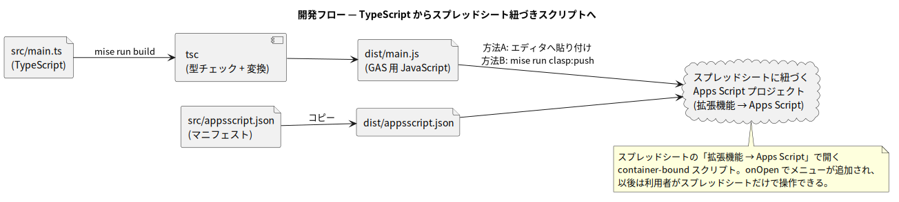

# 第5章 開発環境 — mise / TypeScript / clasp / PlantUML / drawio

[← 第4章](./04-code-walkthrough.md) | [目次](./README.md) | [次章: 運用ガイド →](./06-operations.md)

この章は「コードや図を**修正する人**」向け。使うだけなら第3章まででよい。

## 5.1 リポジトリ構成

```text
gas-drive-migration-2026-07-11/
├── README.md               # プロジェクト概要とクイックスタート
├── mise.toml               # ツール (node) とタスク定義
├── package.json            # npm 依存 (typescript / clasp / 型定義)
├── tsconfig.json           # TypeScript の設定 (GAS 向け)
├── .clasp.json.example     # clasp 設定の雛形 (コピーして .clasp.json に)
├── .mcp.json               # drawio-mcp の設定 (Claude Code 用)
├── src/
│   ├── main.ts             # ★ソースコード本体 (TypeScript)
│   ├── globals.d.ts        # Drive API v3 の最小型定義
│   └── appsscript.json     # GAS マニフェスト
├── dist/                   # ビルド成果物 (コミット済み・コピペ用)
│   ├── main.js             # ★GAS に貼り付けるファイル
│   └── appsscript.json
├── docs/textbook/          # この教科書
├── plantuml/               # 図のソース (.puml) と mise タスク
│   └── out/                # 生成された SVG/PNG (コミット済み)
└── drawio/                 # draw.io 形式の編集可能な図
```

> 💡 `dist/` と `plantuml/out/` は生成物だが、**意図的にコミットしている**。
> 前者は「ビルド環境なしでもコピペで使える」ため、後者は「GitHub 上で教科書の
> 図が表示される」ためである。ソースを変えたら生成物も再生成してコミットすること。

## 5.2 mise — ツールバージョンとタスクの管理

このリポジトリでは、外部 CLI ツール (Node.js や Java) のバージョン固定と
タスクランナーに [mise](https://mise.jdx.dev/) を使う。

<details>
<summary>📖 用語解説: mise (ミーズ)</summary>

プロジェクトごとに開発ツールのバージョンを固定・自動切替するツール
(asdf の後継的存在)。`mise.toml` に「このプロジェクトは node 22 を使う」などと
書いておくと、ディレクトリに入るだけで適切なバージョンが使われる。
`[tasks.xxx]` でタスクランナーとしても使え、npm scripts や Makefile の
代わりになる。

</details>

```bash
# インストール (https://mise.jdx.dev/getting-started.html)
curl https://mise.run | sh

# このプロジェクトの設定を信頼する (初回のみ・セキュリティ機構)
cd gas-drive-migration-2026-07-11
mise trust
cd plantuml && mise trust && cd ..

# ツールを導入してタスクを実行
mise install
mise run setup        # npm install
```

### タスク一覧

| コマンド | 内容 |
| --- | --- |
| `mise run setup` | npm 依存のインストール |
| `mise run typecheck` | 型チェックのみ |
| `mise run build` | `dist/` へビルド (tsc + マニフェストコピー) |
| `mise run clasp:login` | clasp の Google ログイン |
| `mise run clasp:push` | ビルドして GAS プロジェクトへ反映 |
| `mise run docs:diagrams` | 教科書の図 (SVG) を再生成 |
| (plantuml/ 内) `mise run plantuml:generate svg,png` | 図を任意フォーマットで生成 |

### ネットワーク制限環境での Tips (実体験に基づく)

プロキシ等で外部ダウンロードが制限された環境では次が役立つ。

- **PlantUML jar**: GitHub releases がブロックされる環境向けに、
  `plantuml/mise.toml` のダウンロードタスクは **Maven Central への
  フォールバック**を実装済み (中身は同一の jar)
- **JDK が取得できない環境**: システムに Java (11+) が入っていれば
  `MISE_DISABLE_TOOLS=java mise run plantuml:generate` で mise 管理の Java を
  バイパスしてシステム Java を使える
- **mise 本体**: `curl https://mise.run` がブロックされる場合、
  `npm install -g @jdxcode/mise` でも導入できる (npm レジストリは
  通ることが多い)

## 5.3 TypeScript とビルド



ソースは TypeScript ([`src/main.ts`](../../src/main.ts)) で書き、`tsc` で
GAS 用 JavaScript ([`dist/main.js`](../../dist/main.js)) に変換する。

<details>
<summary>📖 用語解説: TypeScript / tsc / トランスパイル</summary>

TypeScript は JavaScript に型 (この変数は文字列、この関数は数値を返す、など) を
書き足せる言語。コンパイラ `tsc` が型の矛盾を実行前に検出してくれるため、
「typo でプロパティ名を間違えた」「null かもしれない値を使った」といったバグを
実行せずに潰せる。tsc は型を取り除いた素の JavaScript を出力する
(この変換をトランスパイルと呼ぶ)。GAS が実行するのは出力された JavaScript の方。

</details>

### GAS 向け TypeScript の特殊事情

[`tsconfig.json`](../../tsconfig.json) にはっきり表れている。普通の Web/Node
プロジェクトとの違いはここ:

| 設定 | 値 | 理由 |
| --- | --- | --- |
| `module` | `"none"` | **GAS は import/export (ES Modules) に対応していない**。全関数がグローバルに置かれる「1枚のスクリプト」として書く。トリガーやエディタから呼べるのはトップレベル関数だけ |
| `target` | `"ES2019"` | GAS の V8 ランタイムが確実にサポートする構文レベルに合わせる |
| `types` | `["google-apps-script"]` | `Logger` や `PropertiesService` など組み込みサービスの型を効かせる |

<details>
<summary>📖 用語解説: V8 ランタイム</summary>

GAS のスクリプト実行エンジン。Chrome や Node.js と同じ JavaScript エンジン
「V8」ベースで、モダンな構文 (クラス、アロー関数、const/let など) が使える。
旧 Rhino ランタイムの後継。ただしモジュール機構 (import/export) は使えない。

</details>

もう1つ、Drive API v3 (高度なサービス) のグローバル `Drive` には公式の型定義
パッケージがないため、**使うメソッドだけを [`src/globals.d.ts`](../../src/globals.d.ts)
に自前で宣言**している。全部の型を書こうとせず「使う範囲だけ正確に」が保守のコツ。

<details>
<summary>📖 用語解説: .d.ts (型定義ファイル) / DefinitelyTyped</summary>

`.d.ts` は「実装はないが型情報だけがある」TypeScript のファイル。JavaScript
ライブラリに後付けで型を与えるのに使う。世界中のライブラリの型定義を集めた
リポジトリが DefinitelyTyped で、`npm install @types/xxx` で取り込める。
`@types/google-apps-script` もその一つ。

</details>

## 5.4 clasp — ローカルから GAS へデプロイ

<details>
<summary>📖 用語解説: clasp (クラスプ)</summary>

Google 公式の GAS 用コマンドラインツール (Command Line Apps Script Projects)。
ローカルのファイルを GAS プロジェクトへアップロード (`clasp push`) /
ダウンロード (`clasp pull`) できる。これによりコードを Git で管理し、
好きなエディタで開発できるようになる。

</details>

初回セットアップ:

```bash
# 1. Google アカウントでログイン (ブラウザが開く)
#    ※移行スクリプトを動かす「移行元アカウント」でログインすること
mise run clasp:login

# 2. GAS 側で「Apps Script API」を有効化
#    https://script.google.com/home/usersettings を開き ON にする (初回のみ)

# 3. 既に作った GAS プロジェクトと紐付ける
cp .clasp.json.example .clasp.json
#    エディタの「プロジェクトの設定」→「スクリプト ID」をコピーして
#    .clasp.json の scriptId に貼る

# 4. ビルドして反映
mise run clasp:push
```

以後、コードを修正したら `mise run clasp:push` するだけで GAS 側に反映される。
`.clasp.json` は個人環境ごとに違うため Git 管理外 (`.gitignore` 済み)。

> 💡 push 対象は `dist/` ディレクトリ (`.clasp.json` の `rootDir`)。
> `src/*.ts` を直接 push しているのではなく、ビルド成果物を送っている。

## 5.5 PlantUML — 図をテキストで管理する

<details>
<summary>📖 用語解説: PlantUML</summary>

図をテキスト (専用記法) で書いて画像に変換するツール。図が「コード」になるため、
Git で差分管理でき、レビューもしやすい。シーケンス図・状態遷移図・
アクティビティ図など UML 系の図が得意。実体は Java 製の jar ファイル。

</details>

この教科書の図はすべて `plantuml/*.puml` がソース。生成手順:

```bash
# 依存 (日本語ラベルの描画に必要)
sudo apt install graphviz fonts-noto-cjk

# 生成 (jar は初回に自動ダウンロードされる)
cd plantuml
mise run plantuml:generate          # svg のみ
mise run plantuml:generate svg,png  # svg と png
# → plantuml/out/*.svg が更新される
```

<details>
<summary>📖 用語解説: Graphviz</summary>

グラフ (ノードと辺) の自動レイアウトエンジン。PlantUML はコンポーネント図や
状態遷移図のレイアウト計算に Graphviz (`dot` コマンド) を使う。
日本語フォント (fonts-noto-cjk) が無いと日本語ラベルが文字化け (豆腐) になる。

</details>

図を修正する流れ: `.puml` を編集 → `mise run plantuml:generate svg,png` →
PNG で見た目を確認 → SVG とともにコミット。各 `.puml` の冒頭にある
`skinparam defaultFontName "Noto Sans CJK JP"` は日本語を確実に描画するための指定。

## 5.6 drawio — マウスで編集する図

テキストより手作業のレイアウトが向く図は [drawio/](../../drawio/) に置く
(現在はアーキテクチャ図の drawio 版)。編集方法は
[drawio/README.md](../../drawio/README.md) を参照。

Claude Code ユーザー向けに、[drawio-mcp](https://github.com/jgraph/drawio-mcp)
を使う MCP 設定を [`.mcp.json`](../../.mcp.json) に用意してある。この
プロジェクトディレクトリを Claude Code で開くと、AI に図の編集を依頼できる。

<details>
<summary>📖 用語解説: MCP (Model Context Protocol)</summary>

AI アシスタントに外部ツールを安全に接続するためのオープンな規格。
`.mcp.json` に「このコマンドを立ち上げて接続して」と書いておくと、
Claude Code などの AI エージェントがそのツール (ここでは draw.io の編集機能) を
呼び出せるようになる。

</details>

---

[← 第4章](./04-code-walkthrough.md) | [目次](./README.md) | [次章: 運用ガイド →](./06-operations.md)
