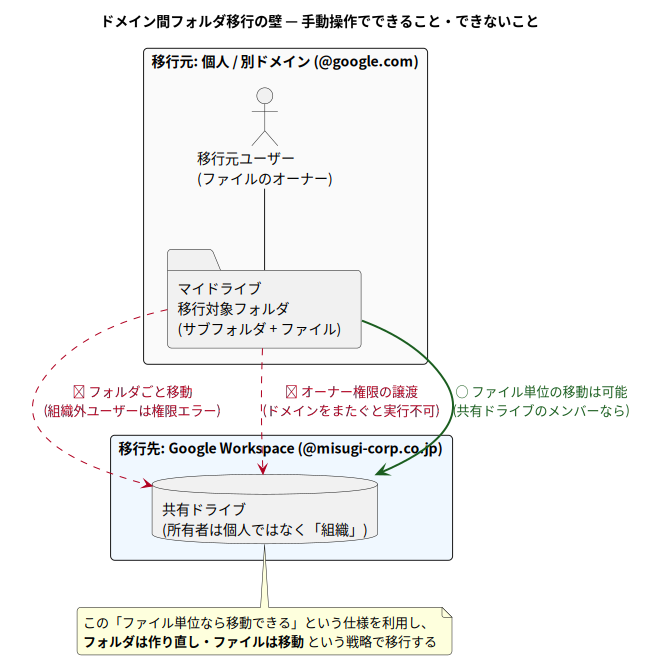

# 📚 教科書: マイドライブ → 別ドメイン共有ドライブ移行ツール

このドキュメント群は、**このプロジェクトに初めて参加する人が、前提知識ゼロから
順番に読むだけで全体を理解できる**ことを目指した教科書である。

Google ドライブの仕様・移行戦略の考え方・GAS のコード・開発環境まで、
一つずつ図と用語解説付きで説明する。

## 対象読者

- このリポジトリに新しく参画したメンバー
- Google ドライブ / Google Apps Script (GAS) をこれから触る人
- 「なぜ普通にフォルダを移動できないのか」から知りたい人

プログラミングの基礎 (変数・関数・ループが読める程度) 以外の前提知識は仮定しない。

## 読み方

- 各章は前の章の内容を前提に書かれているため、**上から順に読む**のがおすすめ
- 専門用語が出てきた箇所には、すぐ下に折りたたみ式の用語解説
  (▶ をクリックすると開く) を置いてある。知っている用語は読み飛ばせばよい
- 図はすべて `plantuml/` のテキストソースから生成しており、`mise run docs:diagrams`
  で再生成できる (→ [第5章](./05-dev-environment.md))

📖 用語解説: アコーディオン (折りたたみ)

まさにこの部分のこと。HTML の `
` タグで実現しており、GitHub の
Markdown 表示ではクリックで開閉できる。本文の流れを邪魔せずに補足説明を
差し込むために使っている。

## 目次

| 章 | タイトル | 内容 |
| --- | --- | --- |
| [第1章](./01-background.md) | 背景 — なぜ普通に移動できないのか | マイドライブと共有ドライブの違い、ドメイン間移行を阻む3つの壁 |
| [第2章](./02-solution-architecture.md) | 解決アプローチとアーキテクチャ | 「フォルダは作り直し・ファイルは移動」戦略、GAS を選んだ理由、実行アカウントの選択 |
| [第3章](./03-setup-guide.md) | セットアップと実行手順 | 事前準備 (権限設定)、GAS プロジェクト作成、設定変数、DRY_RUN → 本実行 |
| [第4章](./04-code-walkthrough.md) | コード解説 | キュー方式・べき等性・自動中断再開・エラー処理の設計と実装 |
| [第5章](./05-dev-environment.md) | 開発環境 | mise / TypeScript / clasp / PlantUML / drawio を使った開発フロー |
| [第6章](./06-operations.md) | 運用ガイド・制限事項・FAQ | 実行時間の目安、維持されるもの/変わるもの、トラブルシューティング |
| [付録](./glossary.md) | 用語集 | 本文中の用語解説の一覧 |

## 全体像を1枚で

「何が問題で、どう解決するのか」はこの2枚に集約される。

