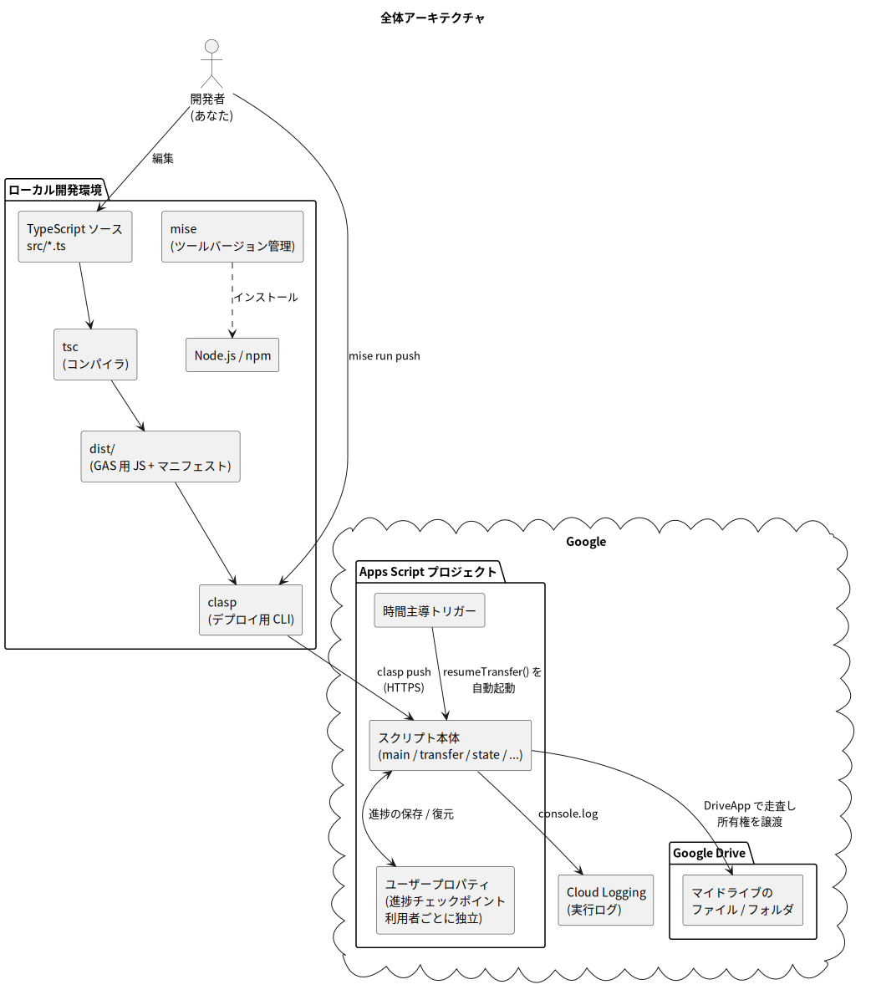

# 第 1 章: このツールは何をするものか

## 1.1 解決したい課題

退職・異動・チーム再編のとき、こんな状況になったことはないでしょうか。

> 「自分の Google Drive に、仕事のファイルが何百・何千と溜まっている。
> これを全部、後任者に引き継ぎたい。」

Google Drive の Web 画面でもファイルの「オーナー権限の譲渡」はできますが、**1 ファイルずつ・多くても 1 画面分ずつ** しか操作できません。フォルダの中にフォルダがあり、その中にまたファイルがある…という階層構造を、手作業で漏れなくたどるのは現実的ではありません。

このプロジェクトは、その作業を自動化する **Google Apps Script(GAS)** です。指定したフォルダを起点に、フォルダ階層を**再帰的に**たどりながら、「自分が所有している」ファイルとフォルダの所有権を、指定した相手へ一括で譲渡します。

利用者インターフェースは **スプレッドシート** です。スプレッドシートに紐付けてデプロイし、「設定」シートのセルに譲渡先と対象フォルダを入力して、カスタムメニュー「所有権譲渡」から実行します。結果は「譲渡ログ」シート(台帳)に 1 件 1 行で記録されます。

📘 用語解説: Google Apps Script(GAS)

Google が提供するスクリプト実行環境です。JavaScript(を拡張した言語)で書いたプログラムを Google のサーバー上で実行でき、Google Drive・スプレッドシート・Gmail などの Google サービスを簡単に操作できる API が最初から組み込まれています。自分のパソコンにサーバーを用意する必要がなく、Google アカウントさえあれば無料で使えます。「ガス」または「ジーエーエス」と読みます。

📘 用語解説: 再帰的(さいきてき)

「ある処理の中で、同じ処理を繰り返し適用していくこと」を指します。ここでは「フォルダを開く → 中のファイルを処理する → 中のフォルダに対しても同じことをする → その中のフォルダにも…」と、階層をどこまでも掘り進んでいく処理のことです。本ツールでは後述のとおり「キュー」という仕組みで同じ結果を実現しています(第 3 章)。

## 1.2 「所有権(オーナー)」とは何か

Google Drive のファイル/フォルダには、必ず 1 人の **オーナー(所有者)** がいます。オーナーは他の共有相手(編集者・閲覧者)とは決定的に違う、次の権限を持ちます。

- ファイルを**完全に削除**できる(ゴミ箱からの完全削除)
- 共有設定を最終的に支配できる
- **オーナー権限を他人に譲渡**できる(これが本ツールが自動化する操作)
- ファイルの容量が**オーナーのストレージ容量として計上**される

📘 用語解説: オーナー / 編集者 / 閲覧者

Google Drive の共有権限は大きく 3 段階あります。

| 権限 | できること |
| --- | --- |
| オーナー | すべて。削除・共有管理・所有権の譲渡。1 ファイルに必ず 1 人だけ |
| 編集者 | 内容の編集、(設定によっては)他ユーザーへの共有 |
| 閲覧者 | 見るだけ(コメント可の「閲覧者(コメント可)」もある) |

「共有しているから大丈夫」と思っていても、オーナーのアカウントが削除されるとファイルごと消えてしまうことがあります。だからこそ退職時には**所有権そのものの引き継ぎ**が重要になります。

重要な性質として、**所有権を譲渡しても、ファイルは移動しません**。ファイルの置き場所(どのフォルダにあるか)や共有設定はそのままで、「オーナーが誰か」だけが変わります。また、元のオーナー(あなた)は自動的に**編集者**として残るため、譲渡した直後にファイルが見えなくなることはありません。

## 1.3 このツールがやること・やらないこと

| | 内容 |
| --- | --- |
| ✅ やること | **明示的に指定した**フォルダ配下の走査(検索走査では自分の全所有物) |
| ✅ やること | 「自分がオーナーである」ファイル/フォルダの所有権を指定ユーザーへ譲渡 |
| ✅ やること | 予行演習(DRY RUN)モードでの対象一覧の確認と、台帳シートへの記録 |
| ✅ やること | 何万件あっても完走するための自動中断・自動再開 |
| ❌ やらないこと | 対象フォルダや譲渡先の推測・デフォルト適用(**未指定は必ずエラー**にする) |
| ❌ やらないこと | ファイルの移動・コピー・削除(場所は一切変えません) |
| ❌ やらないこと | 他人がオーナーのファイルへの操作(自動でスキップします) |
| ❌ やらないこと | 共有ドライブ内のファイルの操作(そもそも所有権の概念がありません) |

📘 用語解説: 共有ドライブとマイドライブ

Google Drive には 2 種類の保存場所があります。

- **マイドライブ**: 個人に紐づく領域。ファイルには個人のオーナーがいる
- **共有ドライブ(旧チームドライブ)**: 組織・チームに紐づく領域。ファイルの所有者は「チーム」であり、**個人のオーナーは存在しない**

共有ドライブのファイルは退職しても消えないため、本ツールのような譲渡は不要です。逆に言えば「マイドライブで仕事のファイルを抱え込んでいる」状態こそが、このツールが必要になる状況です。

## 1.4 全体像

本プロジェクトは「ローカルで開発して、Google 上で実行する」構成です。

*図 1-1: 全体アーキテクチャ(ローカル開発環境と Google 側の関係)*

登場人物を順に説明します。

1. **ローカル開発環境(左)**: コードは TypeScript で書き、`tsc`(コンパイラ)で GAS が実行できる JavaScript に変換して、`clasp` という CLI ツールで Google へアップロード(push)します。ツール類のバージョンは `mise` で管理します。
2. **バインド先スプレッドシート(右上)**: 利用者が触る唯一の場所です。「設定」シートに譲渡先・対象フォルダを入力し、カスタムメニューから実行、「譲渡ログ」シートで結果を確認します。
3. **Apps Script プロジェクト(右)**: スプレッドシートに紐付いたスクリプトの実行環境です。スクリプトは `DriveApp` という組み込み API で Google Drive を走査し、所有権を譲渡します。
4. **ユーザープロパティ / 時間主導トリガー**: 長時間かかる処理を「中断 → 自動再開」するための進捗保存先と目覚まし時計です(第 3 章で詳説)。
5. **Cloud Logging**: 実行ログ(開発者向けの詳細ログ)の確認先です。

📘 用語解説: TypeScript / コンパイル

**TypeScript** は JavaScript に「型」の仕組みを足したプログラミング言語です。たとえば「この変数には文字列しか入らない」と宣言でき、間違った使い方をするとエディタ上や変換時にエラーで教えてくれます。GAS は TypeScript を直接実行できないため、**コンパイル**(変換)して素の JavaScript にしてからアップロードします。この変換を行うのが `tsc` というコマンドです。

📘 用語解説: clasp(クラスプ)

**C**ommand **L**ine **A**pps **S**cript **P**rojects の略で、Google 公式の CLI(コマンドラインツール)です。手元のファイルを Apps Script プロジェクトへアップロード(`clasp push`)したり、逆に取得(`clasp pull`)したりできます。これにより、ブラウザのエディタではなく、使い慣れたエディタ + Git でバージョン管理しながら GAS を開発できます。

📘 用語解説: mise(ミーズ)

プロジェクトごとに「Node.js はバージョン 24、Java は 25」のような開発ツールのバージョンを宣言・管理してくれるツールです。設定は `mise.toml` に書き、`mise install` で全員が同じバージョンを再現できます。「開発者ごとに環境が違って動かない」問題を防ぎます。また `mise run <タスク名>` で、プロジェクト定義済みのタスク(ビルドなど)を実行できます。

## 1.5 必ず知っておくべき前提と制約

### ⚠️ 前提 1: Google Workspace の同一ドメイン間で使う

本ツールは、**Google Workspace(会社・組織のアカウント)で、同じドメイン(例: `@example.com` 同士)のユーザーへ譲渡する**ことを前提にしています。この場合、譲渡は即時に完了します。

- 別ドメインのユーザーへの譲渡は Google 側の制約でエラーになります
- 組織の管理者設定によっては、所有権の譲渡自体が制限されている場合があります
- 個人アカウント(gmail.com)同士では「招待 → 相手が承諾」という別のフローになります(詳細は[付録 B](./06-appendix.md#b-個人アカウントgmailcomの場合))

📘 用語解説: Google Workspace / ドメイン

**Google Workspace** は企業・学校向けの有料 Google サービス一式です(旧称 G Suite)。会社のメールアドレス(例: `taro@example.com`)でログインするアカウントは通常 Workspace アカウントです。**ドメイン**とはメールアドレスの `@` より後ろの部分のことで、Workspace では組織 = ドメインという単位で管理者がポリシーを設定します。

### ⚠️ 前提 2: 所有権の譲渡は「実質的に不可逆」

譲渡した所有権を戻すには、**新しいオーナーが逆方向の譲渡操作をする**しかありません。数千ファイルを間違って譲渡すると、取り戻すのも同じだけ大変です。だからこそ本ツールは、**既定で DRY RUN(予行演習)モード**になっており、実際の譲渡を行う前に対象一覧をログで確認できるようになっています。

📘 用語解説: DRY RUN(ドライラン)

「乾いた実行」= 水を流さない予行演習、という意味の慣用表現です。本番と同じ手順・同じ判定ロジックで動かしつつ、**実際の変更操作だけを行わない**モードを指します。破壊的・不可逆な操作を自動化するツールでは、必ず DRY RUN を先に実行して結果を確認するのが鉄則です。

### ⚠️ 前提 3: GAS には実行時間の制限がある

GAS のスクリプトは **1 回の実行につき最大 6 分**で強制終了されます。ファイルが数万件あれば、当然 6 分では終わりません。本ツールはこの制限を「処理を小分けにして、進捗を保存し、自動で再開する」ことで乗り越えます。この仕組みこそが本プロジェクトの設計の中心であり、第 3 章で詳しく解説します。

📘 用語解説: クォータ(quota)

サービスの使いすぎを防ぐためにベンダーが設ける利用上限のことです。GAS には「1 実行 6 分」のほかにも「トリガーによる合計実行時間は 1 日あたり最大 6 時間(Workspace の場合)」などのクォータがあります。上限値の一覧は第 5 章に整理しています。

## 1.6 2 つの走査戦略

本ツールには、対象ファイルの集め方が 2 種類あります(実装は第 4 章)。

どちらもスプレッドシートのメニューから実行します。

| | ツリー走査(メニュー「開始(ツリー走査)」) | 検索走査(メニュー「開始(検索走査)」) |
| --- | --- | --- |
| 集め方 | 指定した起点フォルダから階層を再帰的にたどる | 「自分が所有する」全アイテムを Drive 全体から検索 |
| 対象の指定 | ✅ 起点フォルダの指定が**必須**(誤爆防止のため未指定はエラー) | フォルダ指定は使わない(常に全所有物が対象であることをダイアログで明示) |
| フォルダ外のファイル※ | ❌ 見つけられない | ✅ 見つけられる |
| おすすめの使い方 | 基本はこちら。引き継ぎ対象のフォルダを指定して実行 | ツリー走査の後に「取り残しがないか」の総ざらいに使う |

※「フォルダ外のファイル」とは、他人のフォルダの中に置いた自分のファイルや、どのフォルダにも属さない「オーファン(迷子)ファイル」のことです([付録 A](./06-appendix.md#a-検索走査の詳細とツリー走査の取りこぼし))。

---

次章では、実際に手を動かして開発環境を作り、自分の Apps Script プロジェクトへコードをデプロイします。

➡️ [第 2 章: 開発環境の構築から初回デプロイまで](./02-setup.md)
