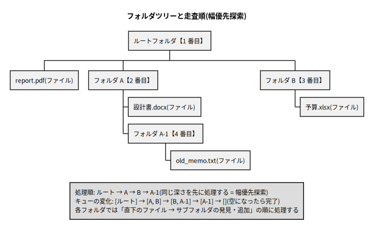
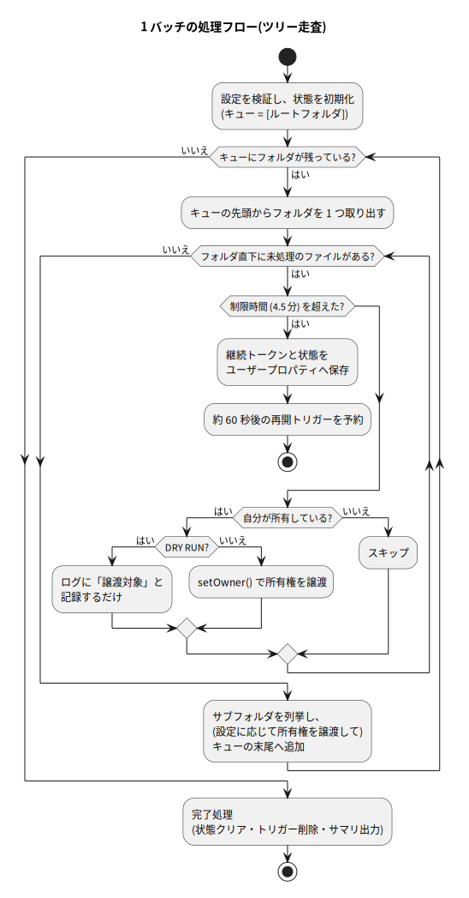
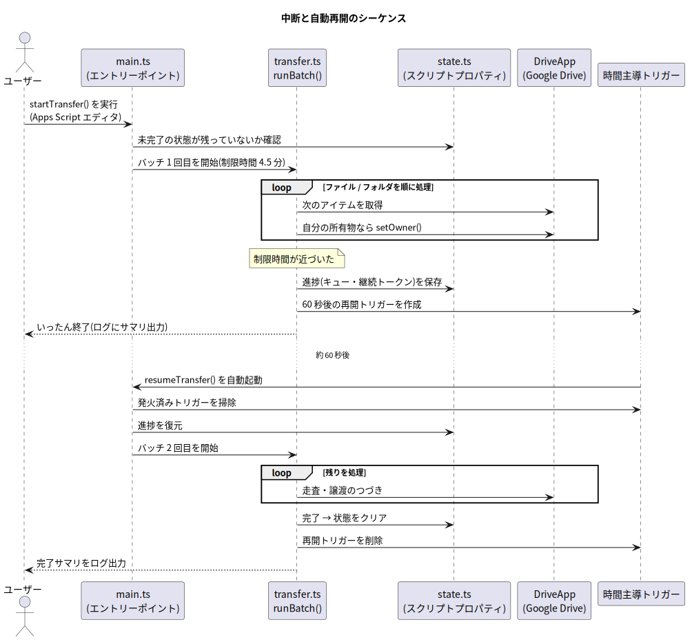

# 第 3 章: 設計を理解する

この章では「なぜこういう作りになっているのか」を解説します。コードの字面を追う前にこの章を読むと、第 4 章がすらすら読めるようになります。

## 3.1 最大の敵: 6 分の実行時間制限

第 1 章で触れたとおり、GAS のスクリプトは **1 回の実行につき最大 6 分** で強制終了されます。強制終了はいつ来るか選べません。ファイルを 1 万件処理する途中でぶつ切りにされたら、「どこまでやったか」が分からなくなってしまいます。

そこで本ツールは、マラソンを区間走に変える作戦をとります。

1. **バッチ処理**: 1 回の実行では「安全マージンを引いた 4.5 分」だけ働く
2. **チェックポイント**: 時間切れが近づいたら、進捗(どこまで処理したか)を保存する
3. **自動再開**: 「60 秒後に自分を起こしてくれ」と目覚まし(トリガー)を仕掛けて終了する。起こされたら保存地点から続きを処理する

この 3 点セットを、全件処理が終わるまで繰り返します。実行状態の遷移を図にすると次のとおりです。


*図 3-1: 実行状態の遷移。「実行中 → 再開待ち → 実行中 → …」のループを完了まで繰り返す*

<details>
<summary>📘 用語解説: バッチ処理</summary>

データをためておいて一定量ずつまとめて処理する方式のことです。ここでは「時間制限内で処理できる分だけを 1 単位(= 1 バッチ)として実行する」という意味で使っています。対義語は、要求のたびに即時処理する「オンライン処理」「リアルタイム処理」です。

</details>

<details>
<summary>📘 用語解説: チェックポイント</summary>

処理の途中経過を保存しておく地点(またはその保存データ)のことです。ゲームのセーブポイントと同じ発想で、障害や中断があっても「最初からやり直し」ではなく「セーブ地点から再開」できるようにします。長時間バッチ処理の定石です。

</details>

<details>
<summary>📘 用語解説: 時間主導トリガー</summary>

「指定時刻(または一定間隔)になったら、指定した関数を自動実行する」という GAS の仕組みです。英語では time-driven trigger。本ツールでは `ScriptApp.newTrigger('resumeTransfer').timeBased().after(60000).create()` のように「60 秒後に 1 回だけ発火する」使い捨てトリガーを毎バッチ作り直しています。

</details>

## 3.2 フォルダ階層をどうたどるか: キューによる幅優先探索

「再帰的にすべてのファイルを処理する」を素朴に書くと、関数が自分自身を呼ぶ再帰関数になります。しかし再帰関数は、**途中で中断して続きから再開する**のがとても難しいのです(呼び出しの深さ分だけの状態が関数スタックの中に隠れてしまうため)。

そこで本ツールは、再帰の代わりに **「これから処理するフォルダの一覧」を自前のキュー(待ち行列)として持つ** 方式にしています。



*図 3-2: フォルダツリーの走査順。同じ深さのフォルダを先に処理していく(幅優先探索)*

処理のルールはたった 2 つです。

1. キューの先頭からフォルダを 1 つ取り出し、**直下のファイル**をすべて処理する
2. そのフォルダの**直下のサブフォルダ**を(必要なら所有権を譲渡した上で)キューの**末尾**に追加する

これを「キューが空になるまで」繰り返すと、結果としてツリー全体を漏れなく訪問できます。キューの中身は単なる「フォルダ ID の配列」なので、**そのまま保存すれば中断・再開できる**のがこの方式の最大の利点です。

<details>
<summary>📘 用語解説: キュー(queue)</summary>

「先に入れたものを先に取り出す」(FIFO: First In, First Out)データ構造です。スーパーのレジ待ちの列と同じで、末尾に並び(enqueue)、先頭から順に処理されます(dequeue)。本ツールでは JavaScript の配列を `push()`(末尾追加)と `shift()`(先頭取り出し)で使うことでキューとして扱っています。

</details>

<details>
<summary>📘 用語解説: 幅優先探索(BFS)と深さ優先探索(DFS)</summary>

ツリー(木構造)のたどり方の 2 大方式です。

- **幅優先探索(BFS: Breadth-First Search)**: 同じ深さの階層を先に全部訪問してから、次の深さへ進む。キューで実装する
- **深さ優先探索(DFS: Depth-First Search)**: 1 本の枝を行き止まりまで掘ってから戻る。再帰またはスタックで実装する

どちらでも全ノードを訪問できますが、本ツールは「キュー = ただの ID 配列」という保存のしやすさを重視して BFS を採用しています。

</details>

## 3.3 ファイルの途中で時間切れになったら: 継続トークン

キュー方式で「フォルダ単位」の進捗は保存できますが、1 つのフォルダに数千ファイルが入っていることもあります。フォルダの**中身を列挙している途中**で時間切れになる場合に備えなければなりません。

GAS の `DriveApp` はファイル一覧を **イテレータ**(`FileIterator`)として返し、このイテレータは **継続トークン** という「しおり」を発行できます。

```javascript
const files = folder.getFiles();          // イテレータを取得
files.next();                             // 1 件ずつ取り出して処理
const token = files.getContinuationToken(); // ← 今の位置の「しおり」を発行
// ---- ここで実行が終了しても ----
const files2 = DriveApp.continueFileIterator(token); // しおりから再開できる
```

本ツールは時間切れの瞬間に、この継続トークンをキューと一緒に保存します。再開時はトークンからイテレータを復元するので、**同じフォルダの途中からでも正確に続き**を処理できます。

<details>
<summary>📘 用語解説: イテレータ(iterator)</summary>

「全件を一気に配列で渡す」代わりに「`hasNext()`(次はある?)と `next()`(次をちょうだい)で 1 件ずつ取り出す」ためのオブジェクトです。何万件あるかわからないファイル一覧を、メモリに全部載せずに少しずつ処理できます。Drive のように件数が巨大になりうる API では標準的な形式です。

</details>

## 3.4 1 バッチの処理フロー(全体を通して見る)

ここまでの部品(キュー・継続トークン・チェックポイント・トリガー)を組み合わせた、1 バッチの流れが次の図です。



*図 3-3: 1 バッチの処理フロー。ループの各所に「制限時間チェック」が差し込まれている点に注目*

ポイントは、時間切れチェックが**ファイル 1 件を処理するたび**に行われることです。チェックの粒度が粗いと(例: フォルダ単位)、巨大フォルダで 6 分の壁に激突します。細かくチェックし、超えていたら「しおりを挟んで本を閉じる」のが安全です。

そして中断から再開までの登場人物のやりとりをシーケンス図で見ると、次のようになります。



*図 3-4: 中断と自動再開のシーケンス。トリガーが `resumeTransfer()` を呼び、保存された進捗から続行する*

## 3.5 進捗はどこに保存されるのか: ユーザープロパティ

チェックポイントの保存先は **ユーザープロパティ**(`PropertiesService.getUserProperties()`)です。スクリプトに紐づく小さなキー・バリュー保存領域で、実行が終わっても値が残ります(= 永続化)。

`PropertiesService` には共有範囲の異なる 3 種類の領域があり、本ツールは「スクリプト × 利用者」ごとに独立する**ユーザープロパティ**を採用しています。これはスプレッドシート(第 7 章)を共有して複数人で使ったとき、**利用者ごとの進捗が互いに見えず・干渉しない**ようにするためです。

<details>
<summary>📘 用語解説: スクリプトプロパティ / ユーザープロパティ / ドキュメントプロパティ</summary>

`PropertiesService` の 3 種類の保存領域です。

| 種類 | 共有範囲 |
| --- | --- |
| スクリプトプロパティ | スクリプト全体で 1 つ(全利用者で共有) |
| **ユーザープロパティ(採用)** | スクリプト × 利用者ごとに独立 |
| ドキュメントプロパティ | バインドされたドキュメントごと(本ツールでは無関係) |

仮にスクリプトプロパティを使うと、複数人で使ったときに「他人が自分の進捗を上書き・リセットできる」「同時に 1 人しか実行できない」という問題が起きます。ユーザープロパティならこれらが構造的に起きません。

</details>

<details>
<summary>📘 用語解説: 永続化 / キー・バリューストア</summary>

- **永続化(persistence)**: プログラムの実行が終わっても消えない場所(ディスクやデータベース)にデータを保存すること。変数の値は実行終了とともに消えるため、バッチをまたぐ情報は必ず永続化が必要です
- **キー・バリューストア**: 「名前(キー)→ 値」の対応だけを保存する単純なデータベース。プロパティは値として文字列しか保存できないため、複雑なデータは JSON 文字列に変換して保存します

</details>

<details>
<summary>📘 用語解説: JSON(ジェイソン)</summary>

JavaScript Object Notation の略で、`{"name": "太郎", "age": 20}` のようにデータを文字列で表現する標準形式です。JavaScript では `JSON.stringify()`(オブジェクト → 文字列)と `JSON.parse()`(文字列 → オブジェクト)で相互変換できます。本ツールは実行状態のオブジェクトをまるごと `JSON.stringify()` して保存しています。

</details>

ただしプロパティには **「1 つの値につき最大 9KB」** という制限があります。フォルダキューが長くなる(=未処理フォルダ ID が数百件たまる)と 9KB を超える恐れがあるため、本ツールは JSON 文字列を **8,000 文字ずつのチャンク(断片)に分割**して複数のプロパティに保存し、読み出し時に連結して復元します。この実装は第 4 章の `state.ts` で解説します。

## 3.6 二重実行を防ぐ: ユーザーロック

「メニューから開始した直後に、前回の再開トリガーも発火してしまった」というように、**同じ利用者の実行が同時に 2 つ走る**可能性があります。2 つの実行が同じ状態を同時に読み書きすると、進捗が壊れたり同じファイルを二重処理したりします(競合状態)。

これを防ぐのが `LockService` の **ユーザーロック**(`getUserLock()`)です。実行の最初にロックを取得し、取れなければ「他の実行が進行中」と判断して身を引きます。トイレの個室の鍵のようなもので、「鍵が閉まっていたら入らない」という仕組みです。

ロックにも「スクリプト全体で 1 つ」のスクリプトロックと「利用者ごと」のユーザーロックがあり、保存領域(3.5 節)と揃えて**ユーザーロック**を使います。守りたいデータ(ユーザープロパティ)が利用者ごとなので、鍵も利用者ごとで十分であり、別の利用者の実行を不必要にブロックしません。

<details>
<summary>📘 用語解説: 排他制御 / 競合状態(race condition)</summary>

複数の処理が同じデータを同時に触ると、タイミング次第で結果が壊れる問題を**競合状態**と呼びます。これを防ぐために「同時に 1 人しか触れないようにする」仕組みが**排他制御**で、その代表がロック(鍵)です。ロックの取得(`tryLock`)と解放(`releaseLock`)は必ず対で行い、解放は `finally` ブロック(エラー時にも必ず実行される場所)に書くのが定石です。

</details>

## 3.7 トリガーは作りっぱなしにしない

GAS のトリガーには「**1 ユーザー・1 スクリプトあたり 20 個まで**」という上限があります。しかも `after(60秒)` で作る一回限りのトリガーは、**発火した後も一覧に残り続けます**。毎バッチでトリガーを作るのに掃除をしないと、数十バッチで上限に達して新しいトリガーが作れなくなります。

そのため本ツールは徹底して「作る前に消す・終わったら消す」を守ります。

- 再開トリガーを**作る直前**に、既存の再開トリガーを全削除(`scheduleResume()` 内)
- **再開処理の冒頭**で、発火済みトリガーを削除(`resumeTransfer()` 内)
- **完了時・手動停止時**にも全削除(`finishTransfer()` / `stopTransfer()` 内)

## 3.8 2 つの走査戦略の設計比較

第 1 章で紹介した 2 戦略は、共通の土台(バッチ・チェックポイント・再開・譲渡処理)の上に、「対象アイテムをどう列挙するか」だけを差し替えたものです。

| | ツリー走査(`runTreeBatch`) | 検索走査(`runSearchBatch`) |
| --- | --- | --- |
| 列挙方法 | キュー + `folder.getFiles()` / `getFolders()` | `DriveApp.searchFiles("'me' in owners and trashed = false")` |
| 保存する進捗 | フォルダキュー + 処理中フォルダの継続トークン | 検索イテレータの継続トークン |
| 列挙対象 | 起点フォルダ配下のみ | 自分の全所有物(場所を問わない) |
| 弱点 | ツリーの外にある自分のファイルを見つけられない | 本番実行中は「譲渡したファイルが検索結果から消えていく」ため、再開時にページのズレで取りこぼしが起こりうる |

検索走査の「取りこぼし」は、**完了後にもう一度実行すれば残りが検索に引っかかる**ため、実害は「再実行の手間」だけです。ツールもその旨を完了ログで案内します(詳細は[付録 A](./06-appendix.md#a-検索走査の詳細とツリー走査の取りこぼし))。

## 3.9 安全側に倒す設計(セーフティ)

不可逆な操作を自動化するツールなので、随所で「疑わしければ止まる・触らない」を選んでいます。

| 仕組み | 内容 |
| --- | --- |
| DRY RUN が既定 | 「設定」シートのモードの初期値は `DRY RUN(予行演習)`。プルダウンで本番を明示的に選ばない限り 1 件も譲渡されない(本番は確認ダイアログも 2 段階) |
| デフォルト値を持たない | 譲渡先と対象フォルダに既定値はなく、**未指定は必ずエラー**。「うっかり全体に実行」が構造的に起きない |
| 譲渡先の検証 | 空文字・`@` なし・自分自身への譲渡は開始前にエラーで停止 |
| 所有者チェック | 1 件ごとに「本当に自分がオーナーか」を確認してから譲渡(他人のファイルは触らない) |
| 設定のスナップショット | 開始時に「設定」シートの値を状態へ写し取る。実行途中でセルを書き換えても、進行中の処理には影響しない |
| エラーでも止まらない | 1 件の譲渡失敗で全体を止めず、台帳に記録して続行。失敗件数はサマリで報告 |
| 未完了状態の保護 | 前回の処理が残っている場合、新しい処理は開始できない(メニューの「停止(リセット)」で明示的に消すまで) |

---

設計が頭に入ったところで、次章では実際のコードを 1 ファイルずつ読んでいきます。

⬅️ [第 2 章: 開発環境の構築](./02-setup.md) / ➡️ [第 4 章: コードを読む](./04-code-walkthrough.md)
