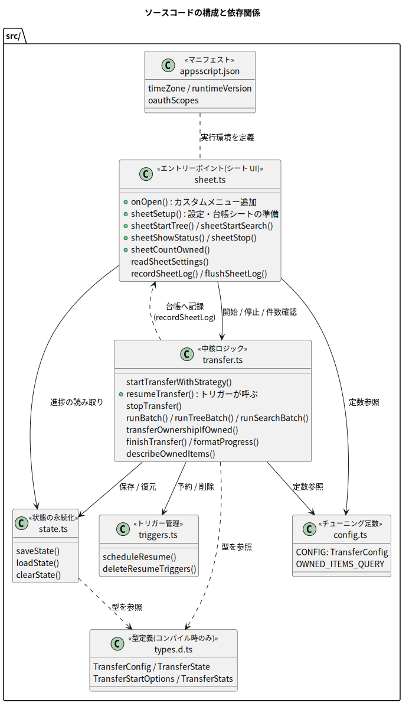

# 第 4 章: コードを読む

この章では、ソースコードをファイルごと・関数ごとに読み解きます。先に[第 3 章](./03-architecture.md)を読んでいる前提です。

## 4.1 ディレクトリ構成

```
gas-drive-ownership-transfer-2026-07-11/
├── mise.toml              # ツールバージョン(Node 24 / pnpm)とタスク定義
├── package.json           # 依存パッケージと build 等のスクリプト
├── pnpm-workspace.yaml    # pnpm の設定(minimumReleaseAge = 1 週間ルール)
├── pnpm-lock.yaml         # 依存バージョンの固定(ロックファイル)
├── tsconfig.json          # TypeScript コンパイラの設定
├── .clasp.json.example    # clasp 接続設定の見本(コピーして .clasp.json を作る)
├── src/                   # ★ 編集するのはここ
│   ├── appsscript.json    # マニフェスト(ビルド時に dist/ へコピー)
│   ├── types.d.ts         # 型定義(コンパイル時のみ使用)
│   ├── config.ts          # 動作チューニング用の定数
│   ├── state.ts           # 進捗の保存・復元(チェックポイント)
│   ├── triggers.ts        # 再開トリガーの管理
│   ├── transfer.ts        # 中核ロジック(走査と譲渡・再開・停止)
│   └── sheet.ts           # エントリーポイント: メニュー・設定シート・台帳(第 7 章)
├── dist/                  # ビルド成果物(自動生成、Git 管理外)
└── docs/textbook/         # この教科書
    ├── plantuml/          # 図の生成元(.puml)+ 生成物(out/*.svg)と mise タスク
    ├── drawio/            # drawio を使う場合の手引き
    └── images/            # drawio 図の SVG 置き場(必要時に作成)
```

ファイル間の関係と役割分担は次の図のとおりです。



*図 4-1: ファイルごとの役割と依存関係。矢印は「呼び出す・参照する」方向*

## 4.2 最重要の前提: GAS には「モジュール」がない

コードを読む前に、この構成を理解する鍵を 1 つ。**GAS には import / export というモジュールの仕組みがありません**。プロジェクト内の全ファイルは、**1 つの大きなグローバルスコープを共有**します。`transfer.ts` の関数を `sheet.ts` から呼ぶのに、import 文は不要(むしろ書けない)なのです。

<details>
<summary>📘 用語解説: モジュール / グローバルスコープ</summary>

- **モジュール**: ファイルごとに変数や関数の名前空間を分け、`export` したものだけを他ファイルが `import` して使う仕組み。現代の JavaScript/TypeScript 開発では標準です
- **グローバルスコープ**: プログラム全体のどこからでも見える名前の領域。GAS では全ファイルのトップレベルに書いた関数・変数がすべてここに置かれます。便利な反面、**名前の衝突**(同名の関数を 2 ファイルに書くと片方が上書きされる)に自分で気をつける必要があります

</details>

そのため `tsconfig.json` では `"module": "none"` を指定しています。これは「モジュール構文を使わない」宣言で、うっかり `import` を書くとコンパイルエラーになり、GAS で動かないコードを事前に弾いてくれます。TypeScript は同じ設定(`include` 対象)のファイル同士の宣言をグローバルとして共有するので、**エディタ上でもファイルをまたいだ補完・型チェックがそのまま効きます**。

```jsonc
// tsconfig.json(抜粋)
{
  "compilerOptions": {
    "target": "ES2019",   // GAS の V8 ランタイムが確実に解釈できる世代の JS を出力
    "module": "none",     // import/export 禁止(GAS にモジュールはないため)
    "outDir": "dist",
    "rootDir": "src",
    "strict": true,       // 型チェックを最も厳しく
    "types": ["google-apps-script"]
  }
}
```

<details>
<summary>📘 用語解説: V8 ランタイム / ES2019</summary>

**V8** は Google Chrome や Node.js の心臓部でもある JavaScript 実行エンジンで、GAS も 2020 年から V8 ベースの実行環境(V8 ランタイム)を使えます。これにより `const` / アロー関数 / クラスなどの現代的な文法が使えます。**ES2019** は JavaScript の言語仕様の年次バージョンの一つで、「この年の仕様までの文法で出力せよ」とコンパイラに指示しています(古めに倒しておくと確実に動きます)。

</details>

ビルドは `package.json` のスクリプトで行います。

```json
"build": "rm -rf dist && tsc && cp src/appsscript.json dist/appsscript.json"
```

`tsc` が `src/*.ts` → `dist/*.js` に変換し、コンパイル対象でないマニフェストは `cp` でコピーしています。clasp は `.clasp.json` の `"rootDir": "dist"` 設定により **dist/ だけ**をアップロードします。

## 4.3 appsscript.json — マニフェスト

```json
{
  "timeZone": "Asia/Tokyo",
  "dependencies": {},
  "exceptionLogging": "STACKDRIVER",
  "runtimeVersion": "V8",
  "oauthScopes": [
    "https://www.googleapis.com/auth/drive",
    "https://www.googleapis.com/auth/script.scriptapp",
    "https://www.googleapis.com/auth/userinfo.email",
    "https://www.googleapis.com/auth/spreadsheets.currentonly",
    "https://www.googleapis.com/auth/script.container.ui"
  ]
}
```

| フィールド | 意味 |
| --- | --- |
| `timeZone` | トリガーやログの時刻の基準。日本時間に設定 |
| `exceptionLogging` | 例外を Cloud Logging(旧称 Stackdriver)へ送る |
| `runtimeVersion` | V8 ランタイムを使う(現在の標準) |
| `oauthScopes` | このスクリプトが要求する権限の一覧(下記) |

`oauthScopes` は**明示的に最小限を列挙**しています。

- `auth/drive`: Drive のファイル操作(走査と `setOwner` に必要)
- `auth/script.scriptapp`: トリガーの作成・削除に必要
- `auth/userinfo.email`: 実行者自身のメールアドレスの取得(`Session.getEffectiveUser()`)に必要
- `auth/spreadsheets.currentonly`: バインド先のシート(設定・台帳)の読み書きに必要。**他のスプレッドシートには触れない**限定スコープ
- `auth/script.container.ui`: カスタムメニューと確認ダイアログの表示に必要

<details>
<summary>📘 用語解説: スコープの最小化</summary>

OAuth スコープは「アプリに渡す権限の範囲」です。マニフェストに `oauthScopes` を書かない場合、GAS がコードから自動推定しますが、**必要以上に広い権限**を要求してしまうことがあります。明示的に列挙することで、承認画面に出る要求権限を自分で管理でき、レビュー時にも「このスクリプトは何ができてしまうのか」が一目で分かります。

</details>

## 4.4 types.d.ts — 型定義

`.d.ts` は「型情報だけ」のファイルで、コンパイルしても JavaScript を出力しません。つまり **GAS には一切アップロードされない、開発時専用**のファイルです。

中心となるのは、バッチをまたいで保存される実行状態 `TransferState` です。

```typescript
interface TransferState {
  strategy: TransferStrategy;   // 'tree' | 'search'
  myEmail: string;              // 実行者(現在の所有者)
  newOwnerEmail: string;        // 譲渡先(開始時の CONFIG のスナップショット)
  dryRun: boolean;
  includeFolders: boolean;
  startedAt: string;            // 開始時刻(ISO 8601)
  batchCount: number;           // 何バッチ目か
  folderQueue: string[];        // ツリー走査: 未処理フォルダ ID のキュー
  current: FolderProgress | null; // ツリー走査: 処理中フォルダの進捗
  searchPhase: 'files' | 'folders'; // 検索走査の段階
  searchToken: string | null;   // 検索走査の継続トークン
  stats: TransferStats;         // 件数の集計
}
```

第 3 章で説明した「キュー」「継続トークン」「設定のスナップショット」が、そのままフィールドとして並んでいることを確認してください。**この構造体を丸ごと JSON にして保存・復元する**のがチェックポイントの正体です。

<details>
<summary>📘 用語解説: interface(インターフェース)</summary>

TypeScript で「このオブジェクトはこういう名前と型のプロパティを持つ」という**形**を宣言する構文です。実行時には消えてなくなり(JavaScript には出力されない)、開発中の型チェックと補完のためだけに存在します。

</details>

<details>
<summary>📘 用語解説: ISO 8601</summary>

日時の国際標準表記で、`2026-07-11T09:30:00.000Z` のような形式です。JavaScript の `new Date().toISOString()` で得られます。末尾の `Z` は UTC(協定世界時)を表します。文字列として保存してもソートや比較がしやすいのが利点です。

</details>

## 4.5 config.ts — 動作チューニング用の定数

このファイルには**動作の調整値だけ**が入っています。実行のたびに指定する設定(譲渡先・対象フォルダ・モード)はここには**存在せず**、スプレッドシートの「設定」シートから読み取ります。デフォルトの譲渡先や対象フォルダを持たないのは意図的な設計で、**未指定のまま動き出す事故を構造的に防ぐ**ためです。

```typescript
const CONFIG: TransferConfig = {
  includeFolders: true,          // フォルダ自体も譲渡するか
  maxRuntimeMs: 4.5 * 60 * 1000, // 1 バッチの時間予算(4.5 分)
  uiFirstBatchMs: 45 * 1000,     // メニューから開始した最初のバッチだけ短くする(45 秒)
  resumeDelayMs: 60 * 1000,      // 再開までの待ち時間(60 秒)
  lockWaitMs: 30 * 1000,         // ロック取得の待ち時間(30 秒)
};
```

- `maxRuntimeMs` が 6 分ちょうどではなく 4.5 分なのは、**時間切れ処理そのもの(状態の保存やトリガー作成)にも時間が必要**だからです。1.5 分の余白が「しおりを挟んで本を閉じる」ための時間です
- `uiFirstBatchMs` は、メニューから開始した直後の**最初のバッチだけ** 45 秒で切り上げるための値です。確認ダイアログの後すぐに「開始しました」を返して操作を戻し、残りはトリガーの自動再開(1 バッチ 4.5 分)に任せます

また、検索走査で使う Drive の検索クエリもここで定義しています。

```typescript
const OWNED_ITEMS_QUERY = "'me' in owners and trashed = false";
```

「自分(`me`)がオーナーに含まれ、ゴミ箱に入っていない」という意味の、Drive 検索の公式クエリ構文です。

## 4.6 state.ts — チェックポイントの保存・復元

第 3 章 3.5 で説明した「9KB 制限をチャンク分割で回避する」実装です。保存先は**ユーザープロパティ**(利用者ごとに独立した領域)で、`stateProps()` という小さな関数に集約しています。保存はこうなっています。

```typescript
function stateProps(): GoogleAppsScript.Properties.Properties {
  return PropertiesService.getUserProperties(); // 利用者ごとに独立した保存領域
}

function saveState(state: TransferState): void {
  const props = stateProps();
  const json = JSON.stringify(state);
  const chunks: string[] = [];
  for (let i = 0; i < json.length; i += STATE_CHUNK_SIZE) {  // 8,000 文字ずつに
    chunks.push(json.slice(i, i + STATE_CHUNK_SIZE));        // 切り分ける
  }
  clearState(); // 前回の保存より短くなったとき、古いチャンクが残らないよう先に全消し
  chunks.forEach((chunk, index) => {
    props.setProperty(STATE_CHUNK_KEY_PREFIX + index, chunk); // TRANSFER_STATE_CHUNK_0, _1, ...
  });
  props.setProperty(STATE_CHUNK_COUNT_KEY, String(chunks.length)); // 個数も記録
}
```

- JSON 文字列を 8,000 文字ごとに切り、`TRANSFER_STATE_CHUNK_0`, `_1`, … という連番キーで保存します
- **書く前に `clearState()` で全消し**している点が地味に重要です。前回 5 チャンク・今回 3 チャンクだった場合、消さずに上書きすると古い `_3`, `_4` が残り、復元時にゴミが混ざります
- 最後にチャンク数を `TRANSFER_STATE_CHUNK_COUNT` に記録し、`loadState()` はこの数を頼りに連結して `JSON.parse()` します

`loadState()` は、チャンクが欠けているなど壊れた状態を見つけると、エラーメッセージ(`stopTransfer()` でリセットせよ)をログに出して `null` を返します。**壊れたデータで走り続けるより、止まって人間に知らせる**方針です。

## 4.7 triggers.ts — 再開トリガーの管理

```typescript
const RESUME_HANDLER_NAME = 'resumeTransfer'; // トリガーが起動する関数名

function scheduleResume(): void {
  deleteResumeTriggers(); // 二重予約やトリガー上限(20 個)超過を防ぐため、先に掃除
  ScriptApp.newTrigger(RESUME_HANDLER_NAME).timeBased().after(CONFIG.resumeDelayMs).create();
  console.log(`約 ${Math.round(CONFIG.resumeDelayMs / 1000)} 秒後に自動で再開します。`);
}

function deleteResumeTriggers(): void {
  for (const trigger of ScriptApp.getProjectTriggers()) {
    if (trigger.getHandlerFunction() === RESUME_HANDLER_NAME) {
      ScriptApp.deleteTrigger(trigger);
    }
  }
}
```

`deleteResumeTriggers()` は「このスクリプトの全トリガーのうち、起動先が `resumeTransfer` のものだけ」を削除します。関数名で絞り込んでいるので、仮に同じプロジェクトへ別のトリガーを手動で足していても巻き込みません。

なお、トリガーは**作成した利用者のもの**として登録され、`getProjectTriggers()` も**自分のトリガーだけ**を返します。スプレッドシートを共有して複数人で使った場合も、各利用者の再開トリガーは互いに見えず、消し合うことはありません(上限 20 個も利用者ごとのカウントです)。

## 4.8 transfer.ts — 中核ロジック

一番大きなファイルです。関数ごとに見ていきます。

### startTransferWithStrategy() — 開始処理

```typescript
function startTransferWithStrategy(strategy: TransferStrategy, options?: TransferStartOptions): void {
  const opts: TransferStartOptions = options === undefined ? {} : options;
  const lock = LockService.getUserLock(); // 利用者ごとの排他(3.6 節)
  if (!lock.tryLock(CONFIG.lockWaitMs)) {
    throw new Error('別の実行が進行中のためロックを取得できませんでした。...');
  }
  try {
    if (loadState() !== null) {
      throw new Error('未完了の処理が残っています。...');
    }
    deleteResumeTriggers(); // 前回の残骸を掃除

    const state = createInitialState(strategy, options);
    if (strategy === 'tree') {
      const root = resolveRootFolder(options.rootFolderId); // 未指定('')はここでエラー
      state.folderQueue.push(root.getId()); // キューの初期値 = 起点フォルダ
      if (state.includeFolders && root.getId() !== DriveApp.getRootFolder().getId()) {
        transferOwnershipIfOwned(root, state, 'folder'); // 起点フォルダ自身の譲渡
      }
    }
    logStartBanner(state);
    runBatch(state, options.maxRuntimeMs);
  } finally {
    lock.releaseLock(); // 何があっても必ず解放
  }
}
```

順に、(1) ロック取得(3.6 節)、(2) 未完了状態がないかの安全確認、(3) 状態の初期化とキューへの起点投入、(4) バッチ実行 — という流れです。

第 2 引数の `options`(`TransferStartOptions` 型)は、**「設定」シートから読み取った実行設定**(譲渡先・対象フォルダ・DRY RUN かどうか)と、「最初のバッチだけ短い時間予算」(`CONFIG.uiFirstBatchMs`)です。sheet.ts の `sheetStartWithStrategy()` が詰めて渡してきます。

細かいけれど大事な点が 3 つあります。

- **対象フォルダは必須**: `resolveRootFolder()` は空文字(未指定)を受け取ると**即エラー**にします。「うっかりマイドライブ全体を対象にする」事故をコードのレベルでも防いでいます(シート側のチェックとの二重防御)
- **起点フォルダ自身の譲渡**: キュー方式では「フォルダの譲渡は、親フォルダを処理するときに行う」ため、一番上の起点フォルダだけは誰にも譲渡されません。そこで開始時に特別扱いで譲渡します。例外として、指定されたのがマイドライブのルートそのものだった場合、ルートは譲渡できない特殊フォルダなので対象外です
- **`finally` でのロック解放**: 途中で例外が飛んでもロックが残らないようにしています

### createInitialState() — 設定の検証とスナップショット

譲渡先メールアドレスの妥当性(空でない・`@` を含む・**自分自身でない**)をチェックし、渡された実行設定を状態オブジェクトへ写し取ります。以後のバッチは常に状態側の値を使うため、実行途中に「設定」シートのセルを書き換えても進行中の処理はぶれません。

### runBatch() — 1 バッチの実行と後始末

```typescript
function runBatch(state: TransferState): void {
  const deadline = Date.now() + CONFIG.maxRuntimeMs; // このバッチの締切時刻
  const suspended =
    state.strategy === 'tree' ? runTreeBatch(state, deadline) : runSearchBatch(state, deadline);
  if (suspended) {
    saveState(state);      // チェックポイント保存
    scheduleResume();      // 60 秒後の再開を予約
    logProgress(state, '制限時間が近づいたため、いったん中断しました');
  } else {
    finishTransfer(state); // 完了処理
  }
}
```

走査関数(`runTreeBatch` / `runSearchBatch`)は「時間切れで中断したら `true`、最後まで到達したら `false`」を返す約束になっており、`runBatch` がその結果に応じて「保存して再開予約」か「完了処理」かを振り分けます。

### runTreeBatch() — ツリー走査の本体

第 3 章の図 3-3 をコードにしたものです。骨格だけ抜き出します。

```typescript
function runTreeBatch(state: TransferState, deadline: number): boolean {
  while (true) {
    if (Date.now() >= deadline) return true;         // ← 締切チェック(フォルダ間)
    let progress = state.current;
    if (progress === null) {
      const nextFolderId = state.folderQueue.shift(); // キューの先頭を取り出す
      if (nextFolderId === undefined) return false;   // キューが空 = 完了!
      progress = { folderId: nextFolderId, phase: 'files', token: null };
      state.current = progress;
    }

    if (progress.phase === 'files') {                 // フェーズ 1: 直下のファイル
      const files = progress.token !== null
        ? DriveApp.continueFileIterator(progress.token)   // しおりから再開
        : DriveApp.getFolderById(progress.folderId).getFiles(); // 最初から
      while (files.hasNext()) {
        if (Date.now() >= deadline) {
          progress.token = files.getContinuationToken();  // ← しおりを挟んで中断
          return true;
        }
        transferOwnershipIfOwned(files.next(), state, 'file');
      }
      progress.phase = 'subfolders';
      progress.token = null;
    }

    // フェーズ 2: サブフォルダ(譲渡してからキューの末尾へ)
    const folders = /* ...ファイルと同様にイテレータを用意... */;
    while (folders.hasNext()) {
      if (Date.now() >= deadline) { /* 同様にしおりを挟んで中断 */ }
      const subfolder = folders.next();
      if (state.includeFolders) {
        transferOwnershipIfOwned(subfolder, state, 'folder');
      }
      state.folderQueue.push(subfolder.getId());      // ← これが「再帰」の正体
    }
    state.current = null; // このフォルダは完了。次のループで次のフォルダへ
  }
}
```

読みどころは 3 つです。

1. **締切チェックの位置**: `hasNext()` で「次がある」と分かった直後、`next()` で取り出す**前**にチェックしています。ここでトークンを取ると、再開時はちょうどそのアイテムから始まります(1 件の取りこぼしも二重処理もない)
2. **フェーズ制**: 1 つのフォルダを「files(直下ファイル)→ subfolders(サブフォルダ)」の 2 段階で処理し、どちらの途中でも中断できるよう `phase` と `token` を進捗として持ちます
3. **`state.folderQueue.push(subfolder.getId())`**: 再帰呼び出しの代わりに、見つけたサブフォルダをキューへ積む。この 1 行がツリー全体の走査を成立させています

### runSearchBatch() — 検索走査の本体

構造は同じで、列挙元が `DriveApp.searchFiles(OWNED_ITEMS_QUERY)`(続いて `searchFolders`)になっただけです。キューは使わず、継続トークン 1 本で進捗を表現します。3.8 節で述べた「本番実行では検索結果が動くため取りこぼしがありうる」性質はコードのコメントにも明記してあります。

### transferOwnershipIfOwned() — 1 件の譲渡

すべての譲渡はこの 1 関数を通ります。ガード(門番)の順序が大切です。

```typescript
function transferOwnershipIfOwned(item: DriveItem, state: TransferState, kind: 'file' | 'folder'): void {
  state.stats.scanned++;
  let label = kind === 'file' ? 'ファイル' : 'フォルダ';
  try {
    label = `${label}「${item.getName()}」(id: ${item.getId()})`;
    const owner: GoogleAppsScript.Base.User | null = item.getOwner();
    const ownerEmail = owner === null ? '' : owner.getEmail();
    if (ownerEmail.toLowerCase() !== state.myEmail.toLowerCase()) {
      state.stats.skippedNotOwned++;   // ガード 1: 自分の所有物でなければ何もしない
      return;
    }
    if (state.dryRun) {
      state.stats.planned++;           // ガード 2: DRY RUN ならログだけ
      console.log(`[DRY RUN] 譲渡対象: ${label}`);
      return;
    }
    item.setOwner(state.newOwnerEmail); // ここで初めて実際の譲渡
    state.stats.transferred++;
    console.log(`譲渡完了: ${label}`);
  } catch (e) {
    state.stats.errors++;              // 1 件の失敗で全体を止めない
    const message = e instanceof Error ? e.message : String(e);
    console.error(`譲渡失敗: ${label}: ${message}`);
  }
}
```

- `getOwner()` が `null` を返すケース(共有ドライブのアイテムなど「所有者がいない」もの)も、ガード 1 で自然にスキップされます
- 全体が `try/catch` で包まれており、権限エラー等が 1 件起きても**記録して次のアイテムへ進みます**。エラー件数はサマリに集計されます

<details>
<summary>📘 用語解説: ガード節(guard clause)</summary>

関数の冒頭で「処理しなくてよい条件」を先に判定して `return` してしまう書き方です。if の入れ子が深くならず、「ここから先は〜であることが保証されている」と読み手が安心して読み進められます。

</details>

<details>
<summary>📘 用語解説: try / catch / finally</summary>

例外(実行時エラー)の処理構文です。`try` ブロックでエラーが起きると `catch` に飛び、プログラム全体の停止を防げます。`finally` はエラーの有無にかかわらず必ず実行されるため、ロック解放などの後片付けに使います。

</details>

### finishTransfer() / formatProgress() — 完了処理とサマリ

完了時は「状態のクリア → トリガー削除 → サマリ出力 → 台帳へのサマリ行記録」を行います。サマリには走査件数・譲渡件数・スキップ件数・エラー件数・残キュー数が含まれ、中断時にも毎回出力されるので、進捗が追えます。整形処理は `formatProgress()` に切り出してあり、ログ出力とメニューの「進捗を確認」ダイアログの両方で同じ文面を使います。

### resumeTransfer() / stopTransfer() — 再開と停止

`resumeTransfer()` は**時間主導トリガーが自動で呼び出す**再開処理です(これだけは人間ではなくトリガーがエントリーポイントになります)。トリガー実行ならではの工夫があります。

```typescript
function resumeTransfer(): void {
  deleteResumeTriggers(); // 発火済みの一回限りトリガーは自動では消えないため、まず掃除
  const lock = LockService.getUserLock();
  if (!lock.tryLock(CONFIG.lockWaitMs)) {
    console.warn('別の実行が進行中です。再開を後回しにします。');
    scheduleResume();     // 諦めずに、もう一度未来の自分に予約を入れて退く
    return;
  }
  // ... 状態を復元して runBatch(state) ...
}
```

ロックが取れなかったとき(前のバッチがまだ動いている等)に、エラーで死ぬのではなく**再予約して身を引く**ことで、再開の連鎖が途切れないようにしています。

`stopTransfer()` は「トリガー削除 → 進捗の最終サマリ出力 → 状態クリア」を行うリセット処理で、メニューの「停止(リセット)」から呼ばれます。

## 4.9 sheet.ts — エントリーポイント(スプレッドシート UI)

利用者が触る唯一のインターフェースです。`onOpen()` がカスタムメニュー「所有権譲渡」を追加し、各メニュー項目が対応する関数を呼びます。

| メニュー項目 | 関数 | 役割 |
| --- | --- | --- |
| 初期設定 | `sheetSetup()` | 「設定」「譲渡ログ」シートを作成(何度実行しても安全) |
| 所有アイテム数を確認 | `sheetCountOwned()` | `describeOwnedItems()` の結果をダイアログ表示 |
| 開始(ツリー走査 / 検索走査) | `sheetStartTree()` / `sheetStartSearch()` | 設定シートを読み、確認ダイアログ(本番は 2 段階)を経て開始 |
| 進捗を確認 | `sheetShowStatus()` | 保存中の進捗をダイアログ表示 |
| 停止(リセット) | `sheetStop()` | 確認の上で `stopTransfer()` を呼ぶ |

実装上のポイントは 3 つです。

1. **入力の検証は入口で**: `sheetStartWithStrategy()` は譲渡先(B2)未入力と、ツリー走査での対象フォルダ(B3)未入力を、**開始前にダイアログでエラー**にします(transfer.ts 側の検証との二重防御)
2. **安全側に倒す読み取り**: `readSheetSettings()` はモード(B4)の値が想定外なら DRY RUN として扱います。フォルダ ID は URL のままの貼り付けにも対応します(`normalizeFolderIdInput()`)
3. **台帳はバッファして一括書き込み**: `recordSheetLog()` は行をメモリにため、バッチの終わりに `flushSheetLog()` が `setValues()` でまとめて書きます。シートへの書き込みは 1 回あたり数十ミリ秒かかるため、数千件を 1 件ずつ書くと 6 分制限を圧迫してしまうからです

シート UI の使い方・共有の考え方は[第 7 章](./07-spreadsheet.md)にまとめています。

## 4.10 コードを読むときのコツ

1. **エントリーポイントから追う**: `sheet.ts` の `sheetStartTree()` → `startTransferWithStrategy()` → `runBatch()` → `runTreeBatch()` → `transferOwnershipIfOwned()` の順に読むと、呼び出しの流れがそのまま処理の流れです
2. **「状態」を主役に読む**: どの関数も「`TransferState` を作る・進める・保存する・復元する」のどれかをしています。図 4-1 と `types.d.ts` を手元に置いて読むと迷子になりません
3. **図と往復する**: 図 3-3(アクティビティ図)と `runTreeBatch()` は 1 対 1 に対応するように書かれています

---

⬅️ [第 3 章: 設計を理解する](./03-architecture.md) / ➡️ [第 5 章: 実行手順(運用マニュアル)](./05-operations.md)
