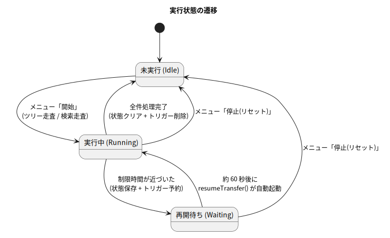

# 第 5 章: 実行手順(運用マニュアル)

この章は、実際に所有権を譲渡するときの手順書です。操作はすべて**スプレッドシートのメニュー「所有権譲渡」**から行います(セットアップがまだの人は[第 2 章](./02-setup.md)を先に)。**上から順に、飛ばさずに**実施してください。特に DRY RUN(Step 2)を飛ばして本番実行してはいけません。

## 5.0 実行前チェックリスト

| # | 確認事項 |
| --- | --- |
| 1 | 譲渡先ユーザーは自分と**同じドメイン**の Google Workspace アカウントか |
| 2 | 譲渡先ユーザーに引き継ぎの合意を取ったか(相手のストレージ容量も消費されます) |
| 3 | 組織の管理者ポリシーで所有権譲渡が禁止されていないか(不明なら小さなフォルダで試す) |
| 4 | 引き継ぐファイルを 1 つのフォルダ(またはいくつかのフォルダ)に整理したか。**対象フォルダの指定は必須**です |
| 5 | 「設定」シートのモード(B4)が `DRY RUN(予行演習)` のままか(最初は必ず DRY RUN) |

## 5.1 Step 0: 初期設定と規模の把握

1. スプレッドシートを開き、メニュー **所有権譲渡 → 初期設定(設定・ログシートを準備)** を実行します(初回は承認画面 → 第 2 章 2.8)
2. 続いて **所有権譲渡 → 所有アイテム数を確認** を実行します

```
自分が所有するアイテム: ファイル 823 件 / フォルダ 141 件
```

のようなダイアログが出ます(1,000 件で打ち切り)。所要時間の見積もり(概ね数千件 / バッチ)と、実行後の突き合わせに使うので、値を控えておいてください。

## 5.2 Step 1: 「設定」シートに入力する

| セル | 入力内容 |
| --- | --- |
| B2 | 譲渡先メールアドレス(**必須**。同じドメインのユーザー) |
| B3 | 対象フォルダの ID または URL(**ツリー走査では必須**。URL を貼れば ID を自動で取り出します) |
| B4 | `DRY RUN(予行演習)` ← まずはこのまま(プルダウン) |

フォルダ ID は、Drive でフォルダを開いた URL の `https://drive.google.com/drive/folders/【この部分】` です。URL ごと B3 に貼り付けても構いません。

> ⚠️ **対象フォルダの指定は必須**です。「うっかりマイドライブ全体を対象にしてしまう」事故を防ぐため、B3 が空欄のままツリー走査を開始するとエラーになります。マイドライブ全体級の総ざらいをしたい場合は、対象を明示するために「開始(検索走査)」(5.6 参照)を使ってください。

## 5.3 Step 2: DRY RUN で対象を確認する

メニュー **所有権譲渡 → 開始(ツリー走査)** を実行します。確認ダイアログに実行者・譲渡先・対象フォルダが表示されるので、**声に出して読むつもりで**確認して OK を押してください。

最初のバッチ(最大 45 秒)が終わると「開始しました」ダイアログが出て、以降はサーバー側で自動継続します。**シートやブラウザは閉じてもかまいません。**

結果は「譲渡ログ」シートにたまっていきます。

| 日時 | 実行者 | 結果 | 種別 | 名前 | ID | 譲渡先 | 詳細 |
| --- | --- | --- | --- | --- | --- | --- | --- |
| 2026/07/11 18:00:12 | you@... | DRY RUN 対象 | ファイル | 議事録_2025-04.docx | 1a2B... | successor@... | |
| 2026/07/11 18:00:12 | you@... | DRY RUN 対象 | フォルダ | プロジェクトA | 9z8Y... | successor@... | |
| … | | | | | | | |
| 2026/07/11 18:14:03 | you@... | サマリ | - | すべての処理が完了しました | | successor@... | 走査 964 件 / 譲渡対象 810 件 / エラー 0 件 |

**確認すべきポイント:**

- 譲渡先メールアドレスは正しいか
- `DRY RUN 対象` の件数は Step 0 の感覚と合っているか(想定外に多い/少ないなら B3 のフォルダを疑う)
- 対象の中に「引き継ぎたくない私物」が混ざっていないか(混ざっていたら対象フォルダを分けてやり直す)

進捗が気になったら **所有権譲渡 → 進捗を確認** を実行すると、走査済み件数・残キュー数などがダイアログで表示されます(表示されるのは自分の実行分だけです)。

## 5.4 Step 3: 本番実行

DRY RUN の結果に問題がなければ、「設定」シートの **B4 を `本番(実際に譲渡する)`** に変えて、もう一度 **所有権譲渡 → 開始(ツリー走査)** を実行します。

本番モードでは確認ダイアログが **2 段階** になります。2 つ目のダイアログには譲渡先がもう一度表示されるので、最終確認してください。

> ⚠️ ここから先、処理されたファイルの所有権は実際に移っています。途中で「停止(リセット)」しても、**それまでに譲渡した分は戻りません**。

## 5.5 Step 4: 長時間ジョブの見守り方

対象が数千件を超えると、完了まで「4.5 分実行 + 60 秒待機」のサイクルを何度も繰り返します(1 万件で 1〜2 時間程度が目安。ファイルサイズには依存しません)。実行状態の遷移は第 3 章の図のとおりです。



*図 5-1(再掲): 今どの状態にいるかは「進捗を確認」メニューと「譲渡ログ」シートで確認できる*

見守りの道具は 2 つあります。

1. **所有権譲渡 → 進捗を確認**: 保存されている進捗(バッチ回数・処理済み件数・残キュー数)をダイアログ表示します。「実行中の処理はありません」と出たら、完了して状態がクリアされた後です
2. **「譲渡ログ」シート**: 処理された分から順に行が増えていきます(書き込みはバッチの区切りごとにまとめて行われます)

開発者向けの補足: バッチごとの実行履歴やエラーの生ログは、Apps Script エディタ(`mise run open`)の「実行数」で確認できます。次の再開予約は「トリガー」画面に `resumeTransfer` として 1 件見えます。

<details>
<summary>📘 用語解説: 実行ログの見方(開発者向け)</summary>

Apps Script エディタで左メニューの「実行数」(時計アイコン)を開くと、メニュー操作やトリガーによる実行の履歴(所要時間・成否・`console.log` の出力)が一覧できます。`譲渡失敗:` の詳細メッセージなど、台帳より細かい情報はここで確認します。より高度な検索は Cloud Logging でも可能です。

</details>

## 5.6 Step 5: 完了確認

1. **進捗を確認** → 「実行中の処理はありません。」
2. 「譲渡ログ」シートの末尾に `サマリ` 行があり、`エラー 0 件` になっている
3. **所有アイテム数を確認** を再実行 → 対象フォルダ分を譲渡し終えていれば、件数が Step 0 より大きく減っている
4. Drive の画面でいくつかのファイルを開き、オーナーが譲渡先になっていることを目視確認
5. 仕上げに **開始(検索走査)** を DRY RUN で実行すると、指定フォルダの外にあった自分の所有物(他人のフォルダ内の自分ファイル、迷子ファイルなど)を洗い出せます([付録 A](./06-appendix.md#a-検索走査の詳細とツリー走査の取りこぼし))

`エラー` 行が残った場合は詳細列のメッセージを確認し、[5.8 トラブルシューティング](#58-トラブルシューティング)で対処します。エラーになったファイルは所有権が移っていないので、原因解消後にもう一度実行すれば拾い直せます(譲渡済みのものは「スキップ」されるだけで無害です)。

## 5.7 知っておくべきクォータ(上限)

| 項目 | 上限 | 本ツールとの関係 |
| --- | --- | --- |
| 1 回の実行時間 | 6 分 | 4.5 分で自主的に中断して回避 |
| トリガー合計実行時間 | 90 分/日(個人)、6 時間/日(Workspace) | 超巨大なフォルダでは 1 日で終わらないことがある。翌日メニューの「開始」ではなく、エディタから `resumeTransfer` を実行すれば続きから再開できる(状態は残っている) |
| トリガー数 | 20 個/ユーザー/スクリプト | 使い捨てトリガーを毎回掃除して回避(3.7 節) |
| プロパティ 1 値(ユーザープロパティ) | 9KB | チャンク分割で回避(4.6 節) |
| プロパティ合計(ユーザープロパティ) | 500KB | キューが極端に長い(数万フォルダ)場合の理論上の壁。実用上はまず到達しない |

最新の正確な値は公式の [Quotas for Google Services](https://developers.google.com/apps-script/guides/services/quotas) を参照してください。

## 5.8 トラブルシューティング

| 症状 | 原因 | 対処 |
| --- | --- | --- |
| メニュー「所有権譲渡」が出ない | シートを開いた直後 / push 前 | 数秒待つか再読み込み。それでも出なければ `mise run push` 済みか、バインド先のシートを開いているかを確認 |
| `設定エラー: B2 に譲渡先...` | 譲渡先が未入力 | 「設定」シート B2 に入力(**デフォルト値はありません**。未入力は必ずエラーになります) |
| `設定エラー: B3 に対象フォルダ...` | 対象フォルダが未入力 | 「設定」シート B3 に ID か URL を入力。全所有物を対象にしたい場合は「開始(検索走査)」を使う |
| `起点フォルダが見つかりません` | ID の誤り、またはアクセス権なし | B3 の値を確認。フォルダ URL をそのまま貼るのが確実 |
| `未完了の処理が残っています` | 前回の実行が中断状態のまま | 続きは放置すれば自動再開する。やり直すなら「停止(リセット)」してから開始 |
| `ロックを取得できませんでした` | 自分の別の実行(トリガー等)が進行中 | 数分待って再実行 |
| 台帳に `エラー` 行が出る | ドメイン外への譲渡、管理者ポリシー、特殊なファイル種別など | 詳細列のメッセージを確認。ドメイン・ポリシー要因なら管理者に相談。当該ファイルだけ手動対応でも可 |
| 譲渡したはずのファイルがまだ自分のオーナーで見える | Drive 画面のキャッシュ | 再読み込み。反映に少し時間がかかることもある |
| `状態データが壊れています` | プロパティの手動編集や保存途中の失敗 | 「停止(リセット)」してから再度開始(譲渡済み分は自動でスキップされる) |
| トリガーが作れない旨のエラー | トリガー 20 個上限 | エディタ「トリガー」画面で不要なトリガーを削除 |
| push 時に `User has not enabled the Apps Script API` | Apps Script API が無効 | [設定ページ](https://script.google.com/home/usersettings)でオンにして数分待つ(2.4 節) |
| push 時にマニフェスト上書き確認が出る | 仕様どおり | `y` を入力(手元が正)。毎回聞かれるのが嫌なら `pnpm exec clasp push -f` |

## 5.9 FAQ

**Q. 間違って譲渡してしまった。戻せる?**
A. 新しいオーナー(譲渡先)のアカウントで逆方向に譲渡し直すしかありません。このリスクを避けるための DRY RUN です。譲渡先が協力してくれる状況なら、このスプレッドシートを譲渡先にも共有し、相手が自分の設定で逆向きに実行する、という手もあります。

**Q. マイドライブ全体を一気に譲渡したい**
A. ツリー走査は誤爆防止のため対象フォルダ必須です。全所有物を対象にするなら **開始(検索走査)** を使ってください(B3 は使われません)。こちらはメニュー名と確認ダイアログで「全アイテムが対象」であることを明示した上で実行されます。

**Q. 特定のフォルダだけ除外したい**
A. 現在の実装に除外機能はありません。運用でカバーするなら「除外したいものを対象フォルダの外へ移動してから実行」が簡単です。実装で対応するなら `runTreeBatch()` のサブフォルダ追加箇所に除外リスト判定を足すのが素直です([付録 E](./06-appendix.md#e-発展課題)参照)。

**Q. 共有ドライブのファイルはどうなる?**
A. 共有ドライブのアイテムには個人のオーナーがいないため、所有者チェックで自動的にスキップされます(何も起きません)。

**Q. ショートカットはどうなる?**
A. ショートカット自体も「自分がオーナーの 1 ファイル」なので、所有権が譲渡されます。リンク先の実体は別ファイルであり、実体のオーナーが自分なら実体側も(走査範囲にあれば)個別に処理されます。

**Q. 実行中に新しいファイルを作ったら?**
A. 走査済みの場所に後から作られたファイルは今回の実行では拾われません。完了後にもう一度実行すれば拾えます。引き継ぎ作業中は新規作成を控えるのが無難です。

---

⬅️ [第 4 章: コードを読む](./04-code-walkthrough.md) / ➡️ [付録: 発展的な話題](./06-appendix.md)
