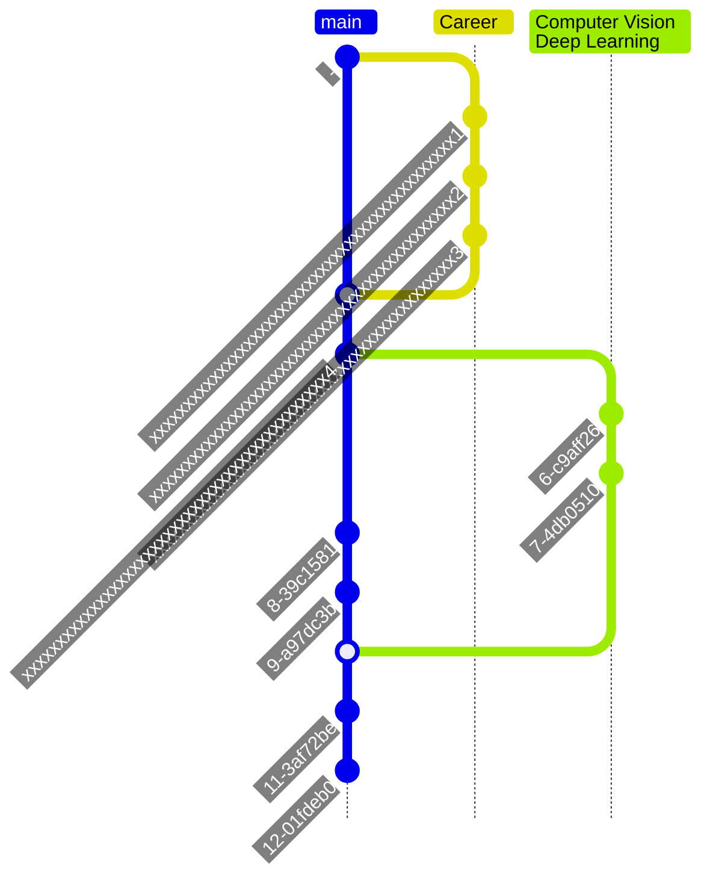

```mermaid
---
init:
  gitGraph:
    rotateCommitLabel: false
config:
  themeVariables:
    commitLabelFontSize: '16px'
    # commitLabelColor: '#ff0000'
    # commitLabelBackground: '#00ff00'
    commitLabelColor: '#ffffff'
    commitLabelBackground: '#000000'
---
gitGraph TB:
  commit id: "-"
  branch "Career"
  commit id: "xxxxxxxxxxxxxxxxxxxxxxxxxxxxxxxxxxxxxxxxxxxxx1"
  commit id: "xxxxxxxxxxxxxxxxxxxxxxxxxxxxxxxxxxxxxxxxxxxxx2"
  commit id: "xxxxxxxxxxxxxxxxxxxxxxxxxxxxxxxxxxxxxxxxxxxxx3"
  checkout "main"
  merge "Career"
  commit id: "xxxxxxxxxxxxxxxxxxxxxxxxxxxxxxxxxxxxxxxxxxxxx4"
  branch "Computer Vision<br>Deep Learning"
  commit
  commit
  checkout main
  commit
  commit
  merge "Computer Vision<br>Deep Learning"
  commit
  commit
```
