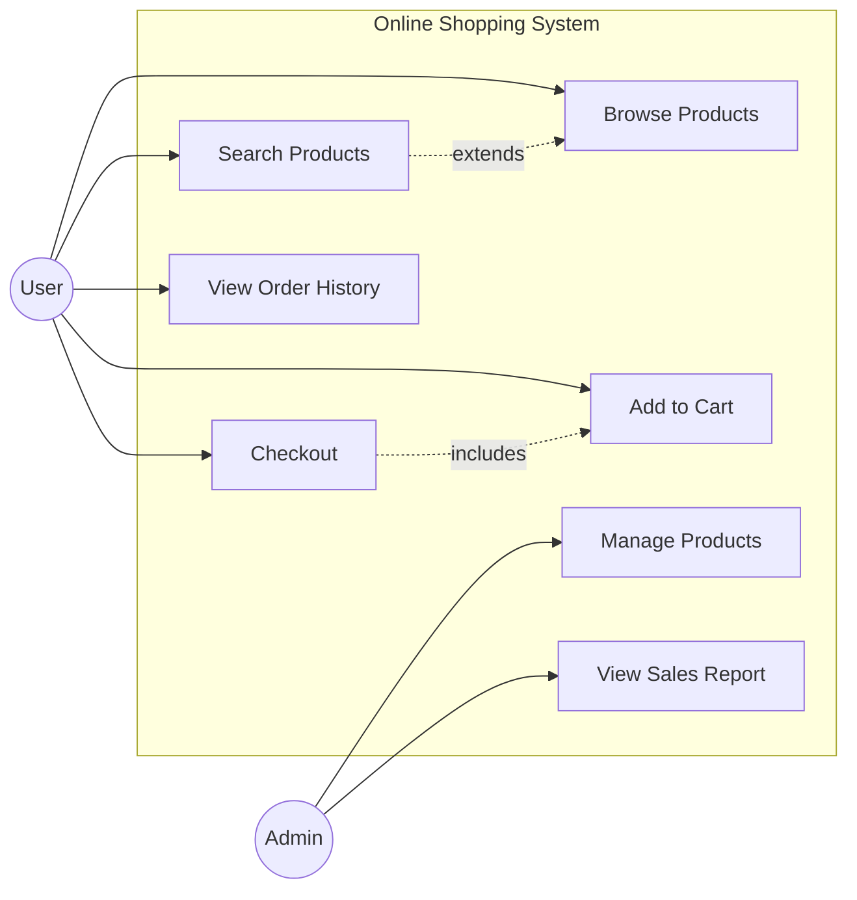

# Mermaid Usecase Diagram Sample

```mermaid
graph LR
  %% Actors
  User(("User"))
  Admin(("Admin"))

  %% System boundary
  subgraph "Online Shopping System"
    UC1["Browse Products"]
    UC2["Search Products"]
    UC3["Add to Cart"]
    UC4["Checkout"]
    UC5["View Order History"]
    UC6["Manage Products"]
    UC7["View Sales Report"]
  end

  %% User associations
  User --> UC1
  User --> UC2
  User --> UC3
  User --> UC4
  User --> UC5

  %% Admin associations
  Admin --> UC6
  Admin --> UC7

  %% Relationships
  UC4 -.->|"includes"| UC3
  UC2 -.->|"extends"| UC1
```
