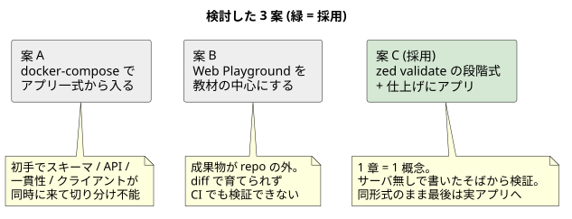

# 001 — 学習パスを「zed validate の箱庭 → サーバ → 応用アプリ」の 3 段にする

- 日付: 2026-09-07
- 状態: 採用

## 背景

SpiceDB を 1 から順を追って理解し、応用アプリでの適用まで見通せる教材 repo を作る。
公式ドキュメントは網羅的だがリファレンス寄りで、「概念を 1 つずつ増やしながら、
最後に実アプリでの座り方まで一本道で読める」ものが欲しかった。

問題は **何を最初に触らせるか**。SpiceDB は
スキーマ言語 / relationship / gRPC API / 一貫性 / クライアント実装、と層が多く、
入口を誤ると初手で全部が同時に来る。

## 検討した案

### 案 A — 最初から docker-compose でアプリ一式を立てる (却下)

現実の構成に一番近く、ゴールから逆算できる。しかし初日に
スキーマ + API + クライアント + 一貫性が同時に来て、
つまずいたとき「どの層で間違えたのか」を切り分けられない。

### 案 B — 公式 Playground (Web) を教材の中心にする (却下)

起動ゼロで触れる手軽さは最強。しかし成果物がブラウザの外にあり、
git で差分として育てられない・練習の再現が手順書頼みになる・CI で検証できない。
「repo として残す教材」に向かない。

### 案 C — `zed validate` を単体テストにした段階式 + 仕上げにアプリ (採用)

`zed validate` の検証ファイル (Playground と同形式) は
**スキーマ + データ + 期待値が 1 ファイル**に閉じ、サーバ無しで数十 ms で検証できる。
これを各章の「実行できる教科書」にする。

- 1 章 = 新出概念 1 つ。`schema.zed` + `validate.yaml` + `README.md` の 3 点セット
- 概念の導入順: schema 基礎 → 集合演算 → arrow (階層) → group → wildcard → caveat。
  後の章のスキーマは前の章の語彙だけで読める
- サーバ (`spicedb serve`) は概念が出そろった 07 で初めて立てる。
  08 で一貫性 (ZedToken)、その先は応用アプリ [app/](../../../app/README.md)

## 決定

1. `tutorial/01〜06` はサーバ不要の `zed validate` 完結。07〜08 は実演スクリプト付き
2. 応用は Go + authzed-go の docshare (Drive 風文書共有 API)。
   スキーマはチュートリアルの最終形をそのまま使う (設計の詳細は [ADR 002](../002_docshare_zedtoken_20260907T004357JST/README.md))
3. 依存 (spicedb / zed / go) は repo の nix flake が抱える。
   `flake.lock` は公開 7 日以上経過の revision に pin (pjp-nix-flake の規約)
4. 練習問題は「わざと壊して `zed validate` の失敗出力を読む」形式に寄せる。
   失敗時のツリー表示が最良の教材だから
5. 一括検証は `scripts/check-all.sh` (全章 validate + app の go vet / go test)

## ポイント (作りながら分かったこと)

- **`zed permission expand` は手元の組み合わせ (zed v1.2.0 × SpiceDB v1.54.0) で
  クライアント側の不具合により失敗する。** デバッグ用途は `check --explain` を正とした
  (07 の README に注記)
- **書き込み直後の check (既定 consistency) が古い revision で評価され false になる**
  現象を構築中に実際に踏んだ。07 の script は `--consistency-full` を明示し、
  現象そのものは 08 の主題として温存した。アプリ側の扱いは [ADR 002](../002_docshare_zedtoken_20260907T004357JST/README.md)
- validate.yaml の `validation:` ブロック (展開結果の固定) は書くのが手間なので
  全章には置かず、展開が面白い 03 (arrow) と 04 (group) だけに置いた
