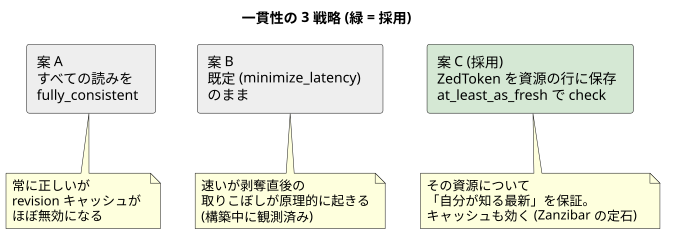

# 002 — docshare は ZedToken を資源の行に保存し at_least_as_fresh を既定にする

- 日付: 2026-09-07
- 状態: 採用
- 親: [ADR 001](../001_learning_path_20260907T004350JST/README.md) (応用アプリを作ること自体の決定)

## 背景

SpiceDB は速さのため、check を量子化された少し古い revision で評価することがある
(既定の `minimize_latency`)。応用アプリ docshare でこれをどう扱うかを決める。

決め手になったのは構築中に**実際に踏んだ**現象:
サーバ起動直後、relationship を書いた数百 ms 後の check (既定 consistency) が
古い revision で評価され、「書いたはずの関係が無い世界」で false が返った。
これを放置すると逆向きも起きる — **剥奪したのに直後はまだ見える**。
Zanzibar 論文の言う New Enemy 問題そのもので、認可の教材として
いちばん見せたい性質が壊れる。

## 検討した案

### 案 A — すべての読みを fully_consistent にする (却下)

常に正しい。しかし revision が動き続けるためキャッシュがほぼ効かなくなり、
SpiceDB の速さの源泉を捨てる。「全読みが常に最新」は要件でもない。

### 案 B — 既定 (minimize_latency) のまま使う (却下)

速い。しかし剥奪直後の取りこぼしが原理的に起きる。統合テストも
タイミング依存で flaky になる (観測済み)。教材としても実務としても不採用。

### 案 C — ZedToken を資源と一緒に保存し、その資源の check は at_least_as_fresh (採用)

Zanzibar の定石をそのまま実装する。

1. relationship を書く (作成・共有・剥奪) と ZedToken が返る
2. `store.Document.ZedToken` として**文書の行と一緒に**保存する
3. その文書の check で `at_least_as_fresh(ZedToken)` を渡す

資源に紐づかない読みは高水位トークンで補う:

- 一覧 (`LookupResources`) とフォルダの check は「プロセスが最後に見た token」
  (`store.LastZedToken`)
- アプリ起動時の `WriteSchema` が返す token を高水位の初期値にする。
  これで**起動前に外 (run.sh の zed) で書かれた seed も必ず見える**
  (テストでは seed のたびに `Store.ObserveZedToken` で取り込む)

## 変更点

- `store.Document` に `ZedToken` 列を追加。`Store.ObserveZedToken` /
  `Store.LastZedToken` で高水位を管理
- `authz.WriteSchema` が書き込み時点の ZedToken を返すように変更
- check / lookup 系はすべて token を受け取り `at_least_as_fresh` を組み立てる
  (空なら minimize_latency に落ちる)

## ポイント

- 検証: 統合テストの「unshare **直後**の GET が 404」が決定的に通る
  (`app/internal/httpapi/server_test.go`)。案 B ではここが flaky だった
- caveat (期限付き共有) の `current_time` は**常にアプリが渡す**。
  SpiceDB は現在時刻を注入しないため、渡し忘れると CONDITIONAL が返る。
  ラッパ (`authz.CheckDocument`) に閉じ込めて渡し忘れを構造的に防ぐ
- ZedToken は永続化する価値のある「栞」だが永久ではない
  (datastore の GC 窓を過ぎた `at_exact_snapshot` はエラー)。
  高水位に使う分には常に新しい方へ動くので問題にならない
- 概念の説明は [textbook 06 章](../../architecture/textbook/06_consistency.md)、
  体験は [tutorial/08](../../../tutorial/08_consistency/README.md)
