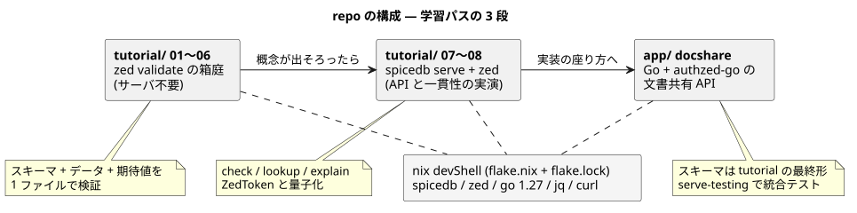
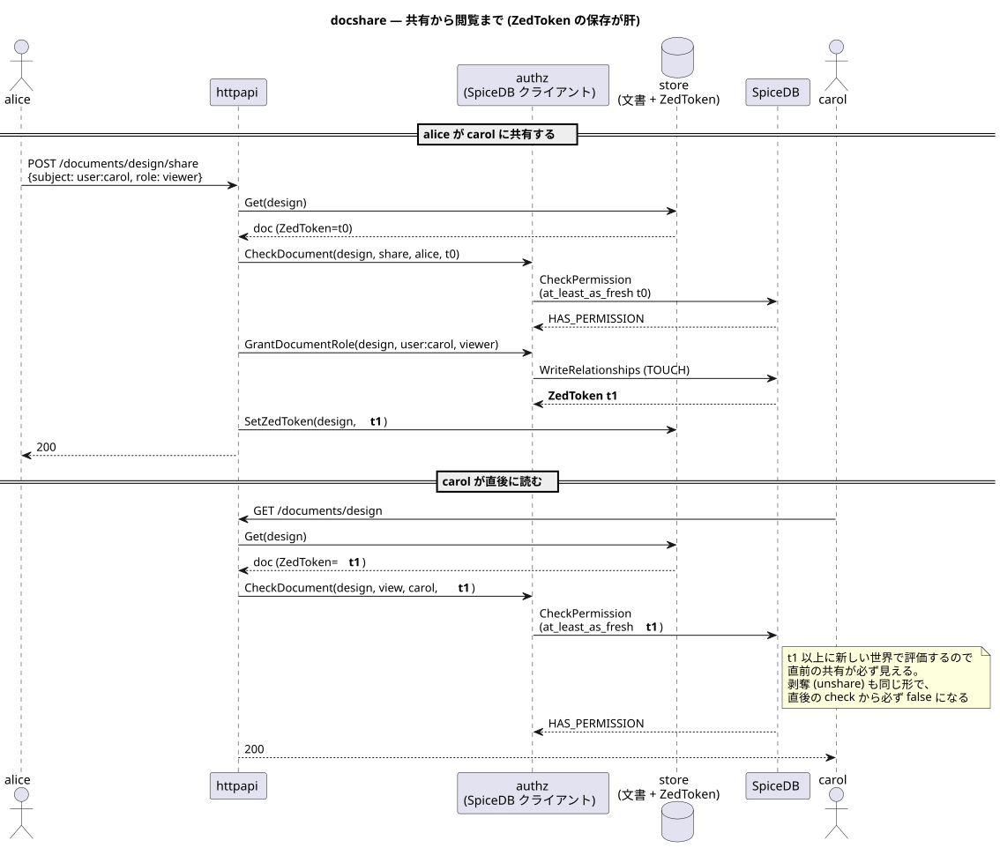

# architecture — いまの構成

この repo は「SpiceDB を 1 から理解して応用まで持っていく」ための教材で、
3 つの部品からできている。**なぜこの形なのか**は [ADR 001](../adr/001_learning_path_20260907T004350JST/README.md)。

| 部品 | 役割 | 検証手段 |
| --- | --- | --- |
| [tutorial/](../../tutorial/README.md) 01〜06 | 概念を 1 つずつ。サーバ不要 | `zed validate` |
| [tutorial/](../../tutorial/README.md) 07〜08 | サーバと一貫性の実演 | `run.sh` (spicedb serve + zed) |
| [app/](../../app/README.md) docshare | 応用: Go 製の文書共有 API | `go test` (spicedb serve-testing) |

依存 (spicedb / zed / go / jq) はルートの `flake.nix` が抱え、
各 script は PATH に無ければ devShell へ自動で入り直す。
一括検証は [`scripts/check-all.sh`](../../scripts/check-all.sh)。

## docshare の形

アプリに権限判定の if 文は無く、認可の問いはすべて SpiceDB へ。
ZedToken を文書の行に保存して剥奪の即時反映を保証する ([ADR 002](../adr/002_docshare_zedtoken_20260907T004357JST/README.md))。

## 読む順

体系立てて理解するなら [textbook/](./textbook/README.md)。
手を動かすなら [tutorial/](../../tutorial/README.md) を 01 から。
