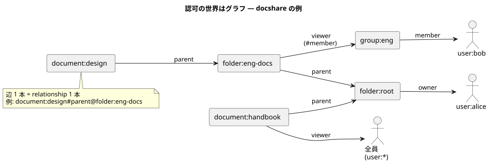

# 01 — ReBAC という考え方

## 権限モデルの系譜

| モデル | 権限の根拠 | 例 |
| --- | --- | --- |
| ACL | 資源ごとの許可リスト | この文書の閲覧者: alice, bob |
| RBAC | 役割 (role) | 「編集者」ロールを持つ人は編集できる |
| ABAC | 属性の論理式 | 部署 = 営業 かつ 等級 ≥ 3 なら閲覧可 |
| **ReBAC** | **関係のグラフ** | 文書 ← フォルダ ← owner という関係をたどれる人 |

<details><summary>ACL (Access Control List)</summary>

資源 1 つずつに「誰が何をできるか」を列挙する最古の形。単純だが、
「eng チーム全員」のような集合や「フォルダの中は全部」のような構造を
表せず、列挙の維持が破綻しやすい。

</details>

<details><summary>RBAC (Role-Based Access Control)</summary>

ユーザーに役割を割り当て、役割に権限を紐づける。組織の職務と相性がよく
社内システムの定番。粒度は「システム全体 × 役割」になりがち。

</details>

<details><summary>ABAC (Attribute-Based Access Control)</summary>

ユーザー・資源・環境の属性を条件式で評価する。柔軟だが、
条件式が増えると「なぜ許可されたのか」の説明が難しくなる。

</details>

## RBAC が苦しくなる瞬間

RBAC の権限は「システム全体でその役割か」に寄っていく。Drive 的な要求は
ほぼ**資源単位**なので、[00 章](./00_introduction.md)の要求リストを RBAC のまま
真面目にテーブル設計すると、次の階段を 1 段ずつ降りることになる。

### 段階 1 — 全体ロールで始める

```sql
CREATE TABLE user_roles (
  user_id TEXT,
  role    TEXT   -- 'admin' | 'editor' | 'viewer'
);
```

```go
if hasRole(user, "editor") { /* 編集 OK */ }
```

きれいに RBAC。しかしこの editor は「**全文書の**編集者」で、最初の要求
「**この**フォルダだけ編集させたい」が既に表せない。

### 段階 2 — ロールに資源スコープを付ける

```sql
CREATE TABLE user_folder_roles (
  user_id   TEXT,
  folder_id TEXT,
  role      TEXT   -- そのフォルダでの 'editor' | 'viewer'
);
```

行数は ユーザー × フォルダ × ロール で増えていく。名前は「ロール」のままだが、
**実体はもう資源ごとの許可の割り当て表 (ACL)** に変質している。
さらに「eng チームの全員に」を配るには `group_members` と `group_folder_roles` を
足し、グループの入れ子が要求された時点で、メンバー解決の再帰クエリを手書きする。

<details><summary>ロール爆発</summary>

資源単位の細かい制御を RBAC でやろうとして、資源 × 操作の数だけ
役割 (またはロール割り当て行) が増殖する現象。段階 2 の表がまさにそれで、
役割の棚卸しが不可能になった時点で統制も破綻する。

</details>

<details><summary>再帰クエリ (WITH RECURSIVE)</summary>

SQL で「グループのグループ」のような深さ不定の構造をたどる書き方
(再帰 CTE)。書けるが、認可のホットパス (全リクエストが通る) に
手書きの再帰 SQL が入ることになり、性能とレビューの両方が重くなる。

</details>

### 段階 3 — 階層継承で、チェックが「表引き」でなくなる

「フォルダの中は親から継承」が入ると、check は 1 回の表引きでは済まなくなる。

```go
func canEdit(user User, folder *Folder) bool {
    for f := folder; f != nil; f = f.Parent() { // 親フォルダへ 1 段ずつ
        if hasFolderRole(user, f, "editor") {
            return true
        }
        if anyGroupHasFolderRole(groupsOf(user), f, "editor") {
            return true
        }
    }
    return false
}
```

ループの形をよく見ると、これは**関係の表をたどるグラフ探索**そのもの。
しかも文書を触るサービス全部が同じループを持つ (共有ライブラリにしても、
言語が違うサービスが 1 つあればもう 1 本書く)。

### 段階 4 — 例外が積もり、仕様が分散する

- 全社公開 → `is_public` カラムを足して check の頭に if を 1 個
- 期限付き共有 → `expires_at` カラムを足して全クエリに WHERE を 1 個
- 「この人だけは何があっても見せない」→ RBAC に **拒否 (deny)** の概念は無いので、
  `banned_users` 表を足して「deny が allow に勝つ」評価順をアプリの規約として決める

この時点で「誰が何を見られるか」の正しさは、**表 4〜5 枚 + if 文の並び順**に
分散している。仕様を一言で答えられる人はもういない。

<details><summary>deny (拒否) と評価順</summary>

許可の集合に「例外として除く」を混ぜると、必ず「どちらが勝つか」の
順序規則が要る。RBAC 標準にはこれが無いためアプリ規約になりがち。
SpiceDB では式の中の `-` (exclusion) として順序ごと宣言できる (tutorial/02)。

</details>

### 段階 5 — 逆引きで二重実装になる

「自分が見られる文書の一覧」は、段階 3 の Go のループでは書けない
(全文書に対してループを回すわけにはいかない)。そこで同じ規則を
**SQL の JOIN に裏返してもう 1 回書く**。

check (Go のループ) と一覧 (SQL) は別実装なので、仕様変更のたびに
両方を直す。どちらかの直し漏れが、そのまま権限事故になる。

### 降りきった先が ReBAC

気づけば作っているのは「**関係を表に保存し、チェック時にたどる**」自作エンジンで、
構造はもう ReBAC になっている。ただしテスト・キャッシュ・一貫性の面倒は誰も
見ていない。これを汎用化して専用サービスへ切り出し、磨き上げたものが
Zanzibar であり SpiceDB。つまり「RBAC → ReBAC」は別物への乗り換えというより、
**自作しかけたものの完成品に移る**話になる。

## ReBAC: 権限 = グラフの到達可能性

ReBAC は発想を変える。**世界を「オブジェクト」と「関係」のグラフとして記録し、
権限の問いを「グラフをたどって届くか」に置き換える。**



この図は応用アプリ [docshare](../../../app/README.md) の世界そのもので、
たとえば「bob は design を view できるか」は

```
document:design --parent--> folder:eng-docs --viewer--> group:eng#member --member--> user:bob
```

という**経路が存在するか**の問いになる。冒頭の要求たちが素直に表せる理由は:

- 階層 → 「parent」という辺をたどる規則を 1 行書くだけ (tutorial/03 の arrow)
- グループ → 「グループの member 集合」を辺の先に置くだけ (tutorial/04)
- 逆引き → グラフを逆向きにたどれば「見られる資源の列挙」になる (LookupResources)

<details><summary>到達可能性 (reachability)</summary>

グラフ理論の言葉で「ある頂点から別の頂点へ辺をたどって行けるか」。
ReBAC の権限チェックは、規則 (スキーマ) に従った到達可能性判定と言い切れる。
だから答えが「なぜ許可か」= 「この経路があるから」と説明可能になる
(`zed permission check --explain` がまさに経路を表示する)。

</details>

## SpiceDB は ReBAC + 条件 (ABAC 味)

SpiceDB の本体は ReBAC だが、関係に**条件式** (caveat、tutorial/06) を
付けられるので、ABAC 的な「期限内なら」「この IP からなら」も混ぜられる。
また RBAC は「role という関係」として ReBAC の上に自然に作れる
(role を relation にすればよい)。つまり実務では **ReBAC を土台に、
必要な場所にだけ属性条件を足す**、という使い方になる。

## コラム — GCP IAM は RBAC なのか

Google Cloud の IAM は「permission (`storage.objects.get`) を role に束ね、
principal に role を割り当てる」ので、語彙は RBAC に見える。この章の言葉で
分類すると、**語彙は RBAC、構造は「リソース階層に接ぎ木した RBAC」**になる。

| GCP IAM | 正体 | この章の対応物 |
| --- | --- | --- |
| permission (`storage.objects.get`) | capability そのもの | — |
| role (`roles/storage.objectViewer`) | permission の**束**に名前を付けたもの | RBAC の語彙 (role = 束) |
| role binding (IAM ポリシー) | **(principal, role, リソースノード)** の 3 つ組。org / folder / project / 個別リソースに貼る | 段階 2 (ロールに資源スコープ) |
| 階層継承 (org → folder → project → 資源) | 上位の binding が下に効く。評価は祖先をさかのぼる | 段階 3 (チェックがグラフ探索になる) |
| Google グループ | メンバー解決付きの主体集合 | subject relation ([tutorial/04](../../../tutorial/04_groups/README.md)) |
| IAM Conditions | binding に付く CEL の条件式 (時刻・リソース名など) | caveat — 言語まで同じ CEL ([tutorial/06](../../../tutorial/06_caveats/README.md)) |
| Deny policies | allow に勝つ拒否。後年に別機構として追加された | exclusion (「RBAC に deny が無い」の傍証) |

つまり GCP IAM は、上の**段階 2〜4 を製品として磨き上げたもの**。
語彙は RBAC のまま、評価構造はすでに ReBAC 的なグラフ探索をしている。

それでも GCP IAM が汎用の認可基盤にならないのは、**階層が Google の
リソースツリー 1 本に固定**されているから。アプリ独自の資源や関係 —
文書の owner、期限付き共有、全員公開 — は持ち込めない。Google 自身も、
Cloud IAM とは別に Drive や YouTube の共有は Zanzibar で動かしている。
「自分のアプリに GCP IAM のような権限管理が欲しい」と思ったときに
作ることになるのが、次の SpiceDB モデルになる。

<details><summary>SpiceDB で GCP 風 IAM (role / role_binding) を書く</summary>

`role` を definition にし、capability ごとの relation に `user:*` を
「この役割はこの capability を含む」というフラグとして書く。
`role_binding` が「割り当てられた人 ∩ 役割がその capability を含む」を
intersection で取る。

```zed
definition user {}

definition role {
    // 役割が capability を含むなら user:* を 1 本書く (フラグ扱い)
    relation storage_objects_get: user:*
}

definition role_binding {
    relation principal: user
    relation role: role
    permission storage_objects_get = principal & role->storage_objects_get
}

definition project {
    relation binding: role_binding
    permission storage_objects_get = binding->storage_objects_get
}
```

relationship は 4 本:
`role:object_viewer#storage_objects_get@user:*` (ロールの中身)、
`role_binding:b1#principal@user:alice` と `role_binding:b1#role@role:object_viewer`
(割り当て)、`project:demo#binding@role_binding:b1` (どこに効くか)。
**ロールの中身を変えると割り当て済み全員へ一斉に効く**という RBAC の性質が、
relationship 1 本の増減で再現できる。

なお `role->storage_objects_get` は relation を指す arrow なので、
[03 章の作法](../../../tutorial/03_hierarchy/README.md)からは外れて lint 警告が出る。
ここでは capability の relation 自体が role の公開インターフェースなので、
承知の上でこの形が使われている (AuthZed 公式の例も同じ)。
原典: https://authzed.com/blog/google-cloud-iam-modeling
(ロールを実行時にユーザー定義させる発展形は
https://authzed.com/blog/user-defined-roles)

</details>

次章: [02 — スキーマ言語の全体系](./02_schema_language.md)
