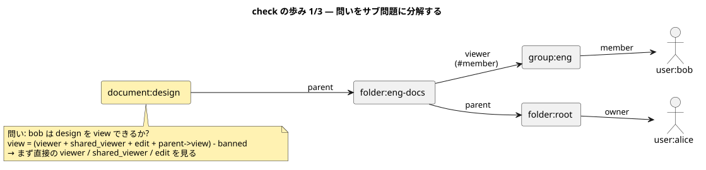
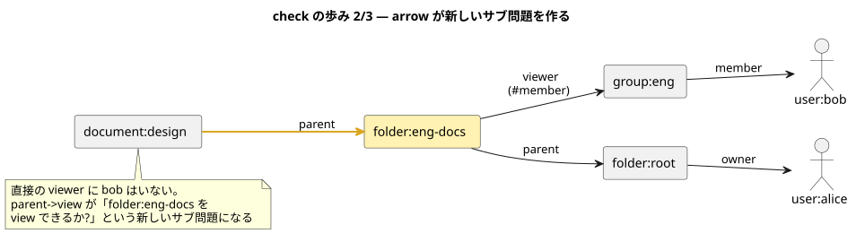
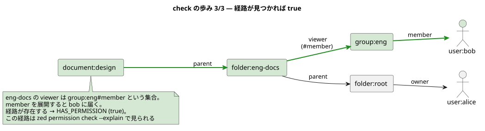
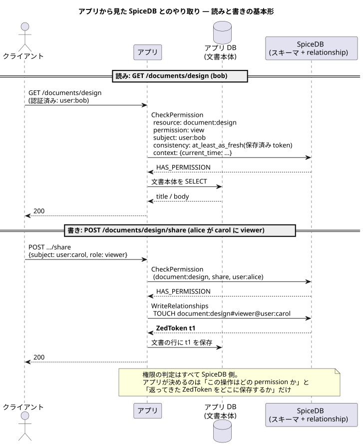

# 03 — relationship と Check の実体

## relationship は「データ」

スキーマが型なら、relationship は行。1 本がグラフの辺 1 つに当たる。

```
document:design#viewer@user:bob
<資源>:<id>#<relation>@<主体>:<id>
```

SpiceDB はこれを自分の datastore (05 章) に**保存する**。ここが重要で、
SpiceDB は「判定エンジン」ではなく「認可データを持つデータベース」。
アプリの DB には文書の中身を、SpiceDB には「誰がどう関わるか」を置く、
という分担になる (分担の設計は [07 章](./07_app_integration.md))。

## 書き込み API

| API | 役割 | 補足 |
| --- | --- | --- |
| `WriteRelationships` | 複数の更新を 1 トランザクションで | 操作は CREATE / TOUCH / DELETE |
| `DeleteRelationships` | フィルタ一致をまとめて削除 | 一致 0 件でもエラーにならない |
| `ImportBulk` / `ExportBulk` | 大量投入・退避 | 移行や初期投入用 |

<details><summary>CREATE と TOUCH の違い</summary>

CREATE は「既にあればエラー」、TOUCH は「あってもなくても最終的にある」(冪等)。
アプリの再試行を考えると、通常は TOUCH を使うほうが扱いやすい。
docshare のラッパも TOUCH に寄せている。

</details>

書き込みはどれも **ZedToken** (その書き込みを含む revision の栞) を返す。
これが後で効いてくる ([06 章](./06_consistency.md))。

## Check はグラフ探索

`Check(document:design, view, user:bob)` が中で何をしているかを、
docshare の世界でコマ送りにする。まず前提を固定する。スキーマは
[app/schema/schema.zed](../../../app/schema/schema.zed) の抜粋
(share / create_document は省略。この抜粋だけでも zed validate が通る形にしてある)。

```zed
definition user {}

definition group {
    relation member: user | group#member
}

caveat not_expired(current_time timestamp, expires_at timestamp) {
    current_time < expires_at
}

definition folder {
    relation parent: folder
    relation owner: user
    relation editor: user | group#member
    relation viewer: user | group#member

    permission edit = owner + editor + parent->edit
    permission view = viewer + edit + parent->view
}

definition document {
    relation parent: folder
    relation owner: user
    relation editor: user | group#member
    relation viewer: user | group#member | user:*
    relation shared_viewer: user with not_expired
    relation banned: user

    permission edit = (owner + editor + parent->edit) - banned
    permission view = (viewer + shared_viewer + edit + parent->view) - banned
}
```

世界を作る relationship は 5 本。**下の図の辺と 1:1 で対応する**。

```
group:eng#member@user:bob                  ← bob は eng のメンバー
folder:root#owner@user:alice               ← alice は root の owner
folder:eng-docs#parent@folder:root         ← eng-docs は root の中
folder:eng-docs#viewer@group:eng#member    ← eng メンバーは eng-docs の viewer
document:design#parent@folder:eng-docs     ← design は eng-docs の中
```

この世界で `Check(document:design, view, user:bob)` を評価する。

**1. 問いを受け取る。** view の定義 `(viewer + shared_viewer + edit + parent->view) - banned`
に従い、サブ問題に分解する。



**2. 直接の viewer に bob はいない。** arrow (`parent->view`) が
親フォルダ eng-docs の view という**新しいサブ問題**を作る。



**3. eng-docs の viewer は `group:eng#member` という集合。** その member を
展開すると bob に届く。経路が見つかったので答えは true。



<details><summary>サブ問題とキャッシュ</summary>

「folder:eng-docs を view できるか」のようなサブ問題の答えは revision 付きで
キャッシュされ、**別の check から再利用される**。上の世界に
`document:roadmap#parent@folder:eng-docs` をもう 1 本足して、
bob が design → roadmap の順に check される場面を考えると:

1. `Check(document:design, view, bob)` — サブ問題
   `folder:eng-docs#view@bob` が生まれ、group → member とたどって true。
   この答えが revision 付きでキャッシュに残る
2. `Check(document:roadmap, view, bob)` — arrow が**同じサブ問題**に行き着いた
   瞬間、キャッシュが即答する。group の展開 (グラフの右半分) はもう歩かない

同じフォルダの文書一覧で N 枚 check しても、フォルダ側の評価が 1 回で済むのは
これ。量子化 (06 章) が「同じ revision」を長持ちさせるのは、このキャッシュの
命中率を保つためでもある。

</details>

<details><summary>dispatch</summary>

SpiceDB を複数ノードで動かすとき、サブ問題を担当ノードへ振り分ける仕組み。
同じサブ問題が同じノードに集まるのでキャッシュ命中率が上がる。
学習中は 1 プロセスなので気にしなくてよいが、「サブ問題に分解される」という
構造がスケールの根拠になっていることは覚えておく価値がある。

</details>

## 問いは Check だけではない

| API | 問い | 使いどころ |
| --- | --- | --- |
| `CheckPermission` | この人はこの資源に X できる? | リクエストの認可判定 |
| `CheckBulkPermissions` | 上をまとめて何件も | 画面の出し分け一括判定 |
| `LookupResources` | この人が X できる資源は? | **一覧画面** (これを知らないと N+1 に落ちる) |
| `LookupSubjects` | この資源に X できる人は? | 共有ダイアログ、監査 |
| `ExpandPermissionTree` | 権限の木そのもの | 管理画面・可視化 |
| `Watch` | relationship の変更ストリーム | キャッシュ無効化、監査ログ |

<details><summary>N+1 問題</summary>

一覧を出すのに「全件取得 → 1 件ずつ check」とすると、
件数ぶんの RPC が飛ぶアンチパターン。逆引きは LookupResources に任せ、
アプリ DB から本体をまとめて引くのが正しい形 (docshare の `GET /documents`)。

</details>

## アプリから見た 1 リクエストの一生

ここまでの部品を、アプリの 1 リクエストに並べるとこうなる。
**読みは「check → 本体を取りに行く」、書きは「check → relationship を書く →
返ってきた ZedToken を保存する」** の形が基本。



- 権限の判定はすべて SpiceDB 側。アプリが決めるのは
  「この操作はどの permission か」だけ (docshare では GET → `view`、共有 → `share`)
- check に添えている consistency と context の意味はそれぞれ
  [06 章](./06_consistency.md) と [tutorial/06](../../../tutorial/06_caveats/README.md)。
  書きで返る ZedToken を保存する理由も [06 章](./06_consistency.md)
- 実装の lane 分け (httpapi / authz / store) まで見たければ
  [architecture の図](../README.md) と [07 章](./07_app_integration.md)

手を動かすなら [tutorial/07](../../../tutorial/07_zed_server/README.md) が
これらを一巡する。次章はその前提になる道具の話。

次章: [04 — zed とスキーマのテスト](./04_zed_workflow.md)
