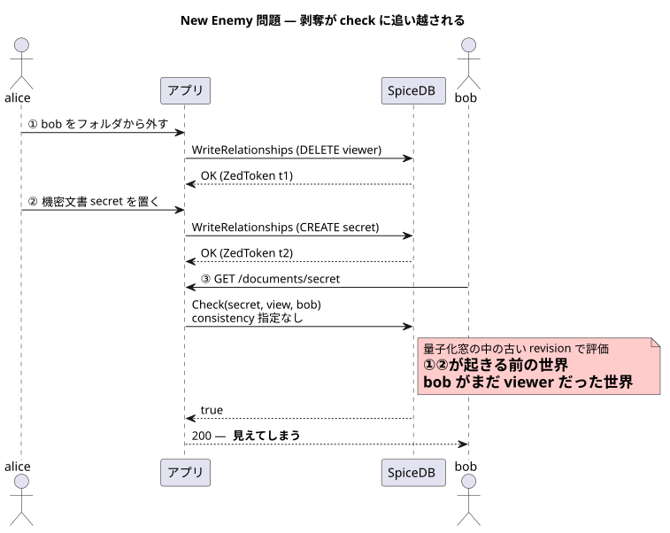
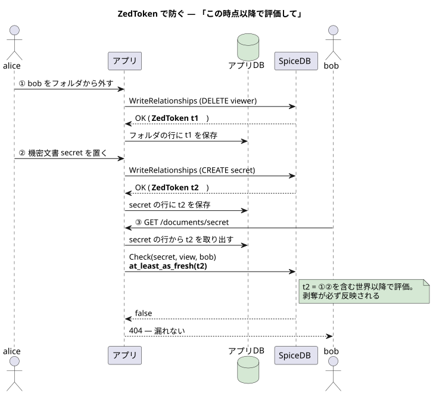
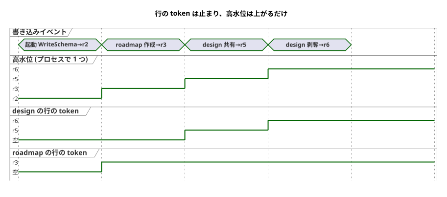

# 06 — 一貫性と New Enemy 問題

**アプリを書く人はこの章だけは飛ばさないこと。**
権限「付与」の遅れは苦情で済むが、権限「剥奪」の取りこぼしは事故になる。

## SpiceDB は少し古い世界で答えることがある

check のたびに最新データで評価すると、revision が動き続けて
キャッシュ (03 章) がほぼ効かない。そこで SpiceDB は時間を一定幅 (既定 5 秒) に
丸め、**窓の中では同じ revision を使い回す**。これが**量子化 (quantization)**。

revision

datastore の「その時点の全 relationship」を指す版番号。
書き込みのたびに進む。check は必ずどれかの revision 上で評価される
(スナップショット読み)。

代償として、既定の consistency (`minimize_latency`) では
**書き込み直後の check が、書き込み前の revision で評価されることがある**。
この repo でも構築中に実際に踏んだ: relationship を書いた数百 ms 後の check が
false を返した ([ADR 002](../../adr/002_docshare_zedtoken_20260907T004357JST/README.md) の背景)。

## New Enemy 問題

「少し古い」が事故になる典型を Zanzibar 論文は **New Enemy 問題**と名付けた。

1. alice が bob をフォルダから外す (剥奪)
2. alice が「bob に見せたくない新文書」をそのフォルダに置く
3. bob の check が**剥奪前の revision** で評価される → 新文書が見える

順序が保存されないことが本質で、キャッシュを持つ認可システムは
どれもこの問題と向き合うことになる。

## ZedToken — 「この時点以降で評価して」という栞

SpiceDB のすべての書き込み (WriteRelationships / DeleteRelationships /
WriteSchema) は **ZedToken** を返す。以後の読みにこれを添えると
「**少なくともこの書き込みを含む世界で評価せよ**」と要求できる。

定石は「**資源の行に ZedToken を 1 列足す**」。

1. 文書の ACL を変えたら、返ってきた ZedToken を文書の行に保存
2. その文書の check では `at_least_as_fresh(保存した token)` を渡す

これで「その資源について自分が知っている最新」より古い世界では評価されない。
実装は [docshare の store](../../../app/internal/store/store.go) がそのまま。

高水位トークン

「資源の行に保存」した token は、**資源が特定できる読み**にしか渡せない。
一覧 (LookupResources) や、行を持たない資源の check (docshare のフォルダ) には
取り出す行が無い。そこで docshare は「プロセスが最後に見た ZedToken」を
1 つだけ別に覚えている。これが**高水位トークン** (`store.lastZedToken`)。

- **行の token は「その資源の最後の ACL 変更」で止まる。** 図で roadmap の行が
  r3 のままなのは、その後の書き込み (r5, r6) が roadmap の見え方に関係ないから。
  資源ごとの必要最小限で、古い revision を許すぶんキャッシュにも優しい
- **高水位は上がるだけ。** どの書き込みでも更新するので、
  「このプロセスが行った / 観測した書き込み全部」を覆う上限になる

| 読み | 渡す token | 保証されること |
| --- | --- | --- |
| `GET /documents/roadmap` | roadmap の行 (r3) | roadmap の ACL 変更は必ず見える |
| `GET /documents` (一覧) | 高水位 (r6) | プロセスが知る書き込み全部が見える |

初期値は起動時 `WriteSchema` の返り値 (図の r2)。起動より前に外 (run.sh の seed)
で書かれた分は r2 より古い revision なので、これで覆われる
(`store.ObserveZedToken`、[ADR 002](../../adr/002_docshare_zedtoken_20260907T004357JST/README.md))。

**限界も知っておく。** 高水位は「自分が見たもの」の最大値なので、
**別プロセスが書いた relationship は覆えない** (見ていない token は水位に入らない)。
その分は量子化の窓ぶん遅れて見える (minimize_latency と同じ扱い)。
複数プロセスの間でも確実にしたい資源は、token を共有 DB の行に置く —
つまり定石 (資源の行に保存) に戻る。

## consistency は 4 段階

| 指定 | 意味 | 使いどころ |
| --- | --- | --- |
| `minimize_latency` (既定) | 量子化された revision でよい | 大半の読み。速くてキャッシュが効く |
| `at_least_as_fresh(token)` | token 以上に新しい世界で | **定石**。資源に保存した token を渡す |
| `at_exact_snapshot(token)` | ちょうどその時点で | ページネーション整合・監査の再現 |
| `fully_consistent` | 常に最新 | 剥奪を 1 秒も漏らせない画面。高くつく |

at_exact_snapshot の失効

datastore の GC 窓 (既定 24h 程度) を過ぎた revision を指すとエラーになる。
ZedToken は「しばらく有効な栞」で、永久保存する類のものではない。
at_least_as_fresh は古い token を渡しても「それ以上新しい」だけなので害がない。

fully_consistent の値段

常に最新 revision で評価する = revision キャッシュの再利用がほぼ効かない。
1 回のコストではなくシステム全体のキャッシュ命中率を下げる点が高くつく。
「全部 fully にすれば安全」は、SpiceDB を選んだ理由 (速さ) を捨てる選択。

## 体験する

- [tutorial/08](../../../tutorial/08_consistency/README.md) — 量子化を 8 秒に広げ、
  「剥奪直後でも at-exactly なら true / at-least なら必ず false」を実際に見る
- [docshare の統合テスト](../../../app/internal/httpapi/server_test.go) —
  「unshare 直後の GET が 404」が決定的に通るのは ZedToken の保存があるから

次章: [07 — アプリへの組み込み](./07_app_integration.md)
