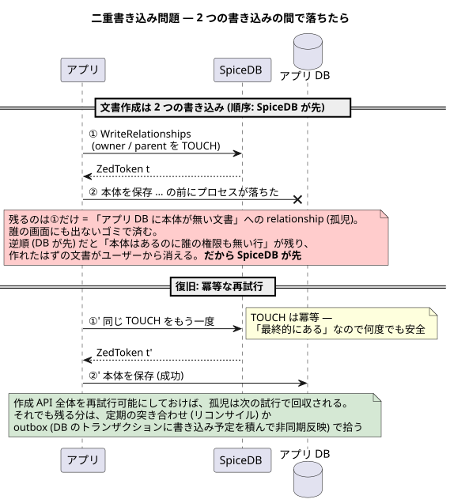

# 07 — アプリへの組み込み

総仕上げ。[docshare](../../../app/README.md) を解剖しながら、
SpiceDB をアプリに組み込むときの判断を一つずつ言葉にする。

## 責務の分担

| 持ち物 | 置き場所 |
| --- | --- |
| 文書の中身 (title / body) | アプリの DB (docshare ではインメモリ store) |
| 誰がどう関わるか | SpiceDB の relationship |
| 誰が何をできるか (規則) | SpiceDB のスキーマ |
| 誰なのか (認証) | 認証基盤 (docshare では `X-User` で省略。OAuth / OIDC との切り分けは [00 章のコラム](./00_introduction.md)) |

アプリのハンドラには権限の if 文を書かない。
「この操作の可否は SpiceDB のどの permission か」だけを決める。


## 読み (check) の置き方

- **ハンドラの入口で 1 回 check** が基本形。docshare は
  `GET /documents/{id}` → `document#view`、`PUT` → `edit`、共有系 → `share`
- **403 と 404 を設計する**: view の無い人には 404 (存在ごと隠す)、
  view はあるが edit が無い人には 403。この出し分け自体が認可の仕様
- 画面の出し分けなどで check が束になるなら `CheckBulkPermissions`

<details><summary>ミドルウェアで check しない理由</summary>

check には資源 ID と permission が要り、それは大抵ルーティング後に決まる。
「認証はミドルウェア、認可はハンドラ冒頭」が収まりがよい。
資源 ID がパスから機械的に取れる設計なら、認可もミドルウェアに寄せられる。

</details>

## 一覧は逆引き API で

「自分が見られる文書一覧」は LookupResources に聞き、
返ってきた ID でアプリ DB から本体をまとめて引く (docshare の `GET /documents`)。
全件取得して 1 件ずつ check する N+1 に落ちないこと。

件数が大きいなら `OptionalLimit` + カーソルでページングし、
並び順や検索と混ぜたい場合は「ID 集合を WHERE IN に混ぜる」形になる。

## 書き込みの作法

資源の作成は「アプリ DB への保存」と「relationship の書き込み」の 2 つの書き込みになる。

```
1. 権限 check (folder#create_document)
2. SpiceDB へ WriteRelationships (owner, parent)   → ZedToken が返る
3. アプリ DB へ保存 (ZedToken も一緒に)
```

<details><summary>二重書き込み問題</summary>

2 と 3 はトランザクションで括れないので、間で落ちるとズレる。



対策は段階がある:

1. **順序を決める**: 先に SpiceDB、後にアプリ DB。孤児になるのは
   「参照されない relationship」で、逆 (権限の無い行) より安全
2. **冪等にして再試行**: TOUCH は冪等なので、作成 API 全体を再試行可能にする
3. **突き合わせ**: 定期ジョブで両者を突き合わせて掃除 (リコンサイル)、
   または DB のトランザクションに書き込み予定を積んで非同期反映 (outbox)

docshare は 1 と 2 の途中まで。教材なので「問題がある」と明示する側に倒した
(該当コードのコメント参照)。

</details>

<details><summary>SoT (Source of Truth)</summary>

「その事実の正本はどこか」。関係の出どころがアプリ操作 (共有ボタン) なら
SpiceDB を関係の SoT にしてよい。出どころが別システム (人事 DB のグループなど) なら
そちらが SoT で、SpiceDB へは同期して**写しを置く**ことになる。
何が正本かを 1 つずつ決めておくと、ズレたとき どちらへ寄せるかで迷わない。

</details>

## 剥奪を取りこぼさない (06 章の実装)

- 書き込みが返す **ZedToken を資源の行に保存**、その資源の check で
  `at_least_as_fresh` — [store.go](../../../app/internal/store/store.go) の主題
- 資源に紐づかない読み (一覧、フォルダ check) は高水位トークン
- caveat の `current_time` は**必ずアプリが渡す**。ラッパ
  ([authz.go](../../../app/internal/authz/authz.go)) に閉じ込めて渡し忘れを防ぐ

## スキーマ変更の運用

- スキーマは repo で管理し、`zed schema write` は **CI (マイグレーション) から**流す。
  docshare は起動時に書いているが、これはデモ用の妥協 (コメントに明記)
- 変更は**後方互換の順序**で: relation を消すときは、先に permission の式から外し、
  参照ゼロを確認してから relation とデータを消す
- スキーマの隣の validate.yaml を必ず更新する (04 章)。
  「見られてはいけない」側の assertion が事故を検知する

## テスト戦略

| 層 | 道具 | この repo での実例 |
| --- | --- | --- |
| スキーマ単体 | `zed validate` | 各 tutorial 章、[app/schema/validate.yaml](../../../app/schema/validate.yaml) |
| アプリ統合 | `spicedb serve-testing` | [server_test.go](../../../app/internal/httpapi/server_test.go) |

serve-testing は preshared key ごとに独立 datastore なので、
テストの並列実行も後片付けも考えなくてよい。モックは作らない —
認可の正しさはスキーマと SpiceDB の意味論に依存していて、モックだと
その部分ごと偽物になるから。

## ここまで来たら

- 公式ドキュメント (https://authzed.com/docs) がリファレンスとして読めるようになっている
- スキーマ設計の引き出しを増やすなら公式の例 (Google Drive / GitHub / Slack 相当) を
  `zed validate` に写して崩してみるのが速い
- 本番導入の残件は運用側: datastore 選定 (05 章)、監視、スキーマ CI、
  そして 06 章の一貫性方針をチームの言葉にすること

おつかれさまでした。全体地図に戻る → [README](./README.md)
